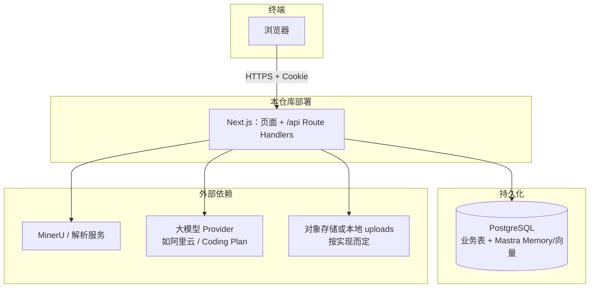
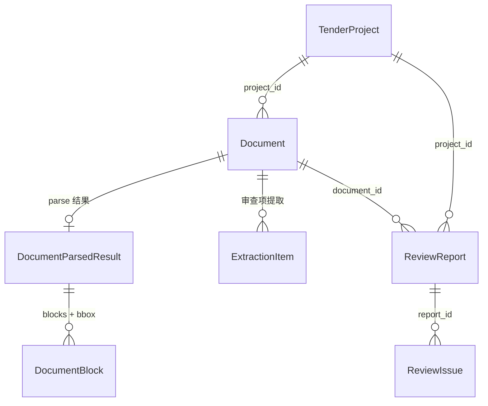
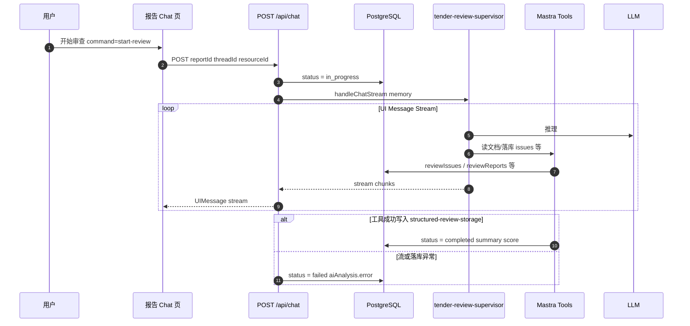
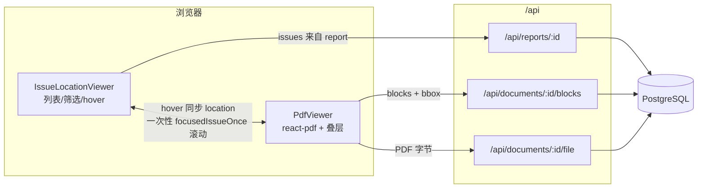

# 智能投标预审智能体（ai-shencha）设计文档

> 文档版本：与代码库同步维护，描述当前架构与关键设计决策。  
> **冲突时以 `src/lib/db/schema.ts`、`src/app/api` 为准**；`docs/` 子目录为专题说明，可能滞后。

## 1. 项目概述

### 1.1 定位

**智能投标预审智能体** 面向招投标／资格预审等场景，支持文档上传与解析（MinerU 等）、结构化区块与坐标、审查项提取、AI 合规审查报告（Chat + Mastra）、问题清单与 PDF 精确定位、组织级统计分析。

### 1.2 目标用户与边界

- **用户**：组织内审查人员（按 `orgId` 隔离数据）。
- **边界**：PDF 预览基于 `react-pdf`（渲染与定位），**不**承担“编辑并写回 PDF 文件”的能力；问题编辑若需上线需另行设计 API 与权限。

---

## 2. 技术栈

| 层级 | 技术 |
|------|------|
| 框架 | Next.js 15（App Router）、React 19 |
| 语言 | TypeScript |
| UI | Tailwind CSS、Radix UI、shadcn 风格组件 |
| 鉴权 | NextAuth v5（beta）+ Drizzle Adapter |
| 数据 | PostgreSQL、Drizzle ORM |
| PDF | `react-pdf` / pdf.js（CDN worker） |
| AI 编排 | Mastra（`@mastra/core`）、`@mastra/ai-sdk` Chat 流、多 Agent + Memory（PG） |
| 其他 | Zod、date-fns 等 |

---

## 3. 系统架构

### 3.1 逻辑分层

```
浏览器 (Dashboard / 报告 Chat / 报告详情 / 分析)
    ↓ HTTPS
Next.js App Router
    ├── Server Components（部分列表/入口）
    ├── Client Components（PDF、Chat、筛选、工作台）
    └── Route Handlers（/api/*）
            ↓
PostgreSQL（业务数据 + Mastra Memory/向量存储）
外部服务：MinerU 解析、大模型 Provider（阿里云等）
```

### 3.2 源码目录（要点）

| 路径 | 职责 |
|------|------|
| `src/app/(auth)/*` | 登录、注册、找回密码等 |
| `src/app/(dashboard)/*` | 工作台：项目、文档、审查项、报告、Chat、统计 |
| `src/app/(dashboard)/projects/.../reports/[reportId]/chat` | 报告审查会话（`useChat` → `/api/chat`） |
| `src/app/api/chat/route.ts` | 审查主入口：`handleChatStream` + Supervisor |
| `src/app/api/*` | 其余 REST 风格 API |
| `src/components/document/pdf-viewer.tsx` | PDF 渲染、高亮、滚动定位、bbox |
| `src/components/review/issue-location-viewer.tsx` | 问题列表、筛选、与 PDF 联动 |
| `src/lib/db/schema.ts` | Drizzle 表定义 |
| `src/lib/auth/*` | NextAuth 配置（`AUTH_SECRET` / `AUTH_URL`） |
| `src/lib/ui/*` | 展示层格式化与中文标签映射 |
| `src/mastra/*` | Mastra 实例、各 Agent、工具与存储 |
| `worker.ts`、`/api/cron/*` | 后台文档状态检查等 |

### 3.3 架构图（Mermaid）

下列图表用于 **评审、交接与改架构时的对照**；若流程或外部依赖有变，请同步改图（见 §13）。

> 提示：若本地预览不显示图，请使用支持 Mermaid 的预览插件，或将代码块复制到 [Mermaid Live Editor](https://mermaid.live)。

#### 系统上下文（谁与谁交互）



#### 核心领域关系（简化 ER）

详细字段见 `schema.ts`；此处只表达 **审查链路** 上的主外键关系。



#### 报告审查时序（Chat + Mastra，当前主路径）

> `POST /api/reports/[reportId]/generate` 已返回 **410**，请勿再按旧「纯文本流 + 路由内 JSON 解析」理解。



#### 报告详情「问题定位工作台」数据流



---

## 4. 核心领域模型（摘要）

详细字段以 `src/lib/db/schema.ts` 为准，此处仅列概念关系。

- **组织 / 用户**：多租户隔离（会话中带 `orgId`）；用户可有角色枚举（招标方、供应商、评审等）。
- **项目 `tenderProjects`**：归属组织，含状态、招标配置 JSON 等。
- **文档 `documents`**：归属项目；`parseStatus`（MinerU）、`extractionStatus`（审查项提取）、`taskProgress`、存储路径等。
- **解析结果 `documentParsedResults`**：全文、结构化内容、MinerU 原始数据。
- **区块 `documentBlocks`**：页码、`blockIndex`、内容、`bbox`（PDF 叠层与问题定位的基础）。
- **审查项 `extractionItems`**（及关联表）：从招标文件等提取的待审查条目，供 Agent 对照投标文件。
- **报告 `reviewReports`**：关联项目与文档；状态见 §4.1；摘要、`recommendation`、`aiScore`、`aiAnalysis` 等。
- **问题 `reviewIssues`**：归属报告，严重度、类别、位置（页码、block、bbox）、是否已解决等。

### 4.1 报告状态（`review_status`）

| 状态 | 含义 |
|------|------|
| `pending` | 待审查 |
| `in_progress` | 审查中（`/api/chat` 收到 `start-review` 时写入） |
| `completed` | 已完成（通常由 `structured-review-storage-tool` 写入；可读问题清单与 PDF 工作台） |
| `failed` | 审查或落库失败（`/api/chat` 异常或存储工具 catch；`aiAnalysis.error` 记录原因） |

### 4.2 文档相关状态（摘要）

- **解析 `parse_status`**：`pending` → `processing` → `completed` | `failed`
- **提取 `extraction_status`**：同上，用于审查项提取管道
- **图片风险 `image_risk_status`**：独立分析任务，见 `/api/documents/.../images`

---

## 5. 关键业务流程

### 5.1 文档上传与解析

1. 经 `POST /api/upload` 或项目文档 API 写入 `documents`，触发 `POST /api/documents/[id]/parse`（MinerU）。
2. 客户端轮询解析状态，或由 `worker.ts` / `POST /api/cron/check-documents` 推进 `parseStatus`、`taskProgress`。
3. 完成后写入 `documentParsedResults` 与 `documentBlocks`（含坐标）。
4. 可选：`POST /api/documents/[id]/extract` 生成 `extractionItems`（`extraction-agent`）。

### 5.2 审查报告生成（Chat，当前主路径）

1. 用户在 **`/projects/[projectId]/reports/[reportId]/chat`** 发起审查；前端经 `useChat` 调用 **`POST /api/chat`**，body 含 `reportId`、`command: "start-review"`，以及 `threadId` / `resourceId`（通常与 `reportId` 对齐）。
2. 路由将报告置为 **`in_progress`**，调用 **`tender-review-supervisor`**（`handleChatStream`，AI SDK v6 消息流）。
3. Supervisor 通过工具链读取文档/审查项、委派子 Agent（如 `image-review-agent`、`report-generation-agent`），最终由 **`structured-review-storage-tool`** 等将 issues、分数、摘要写入 DB，报告置为 **`completed`**。
4. 流或路由层异常时：`/api/chat` 将报告置为 **`failed`**；存储工具内部失败也会写 **`failed`**。
5. **环境依赖**：模型路由见 `src/mastra/config/review.ts`（如 `alibaba-coding-plan-cn/qwen3.6-plus` 需 `ALIBABA_CODING_PLAN_API_KEY`，否则回退 `alibaba-cn/*` 需 `ALIBABA_API_KEY`）。缺 Key 时应在 Chat 中报错，避免静默空结果。

**已废弃**：`POST /api/reports/[reportId]/generate` 返回 **410**，提示改用 Chat。

### 5.3 问题定位工作台（报告详情页）

路径：**`/projects/[projectId]/reports/[reportId]`**（非 Chat 页）。

**布局**：左侧问题列表 + 右侧 `PdfViewer`。

**数据流**：

- 问题位置：`reviewIssues.location`（`pageNumber`、`blockIndex`、可选 `bbox`）。
- 区块兜底：无 bbox 时用同页 `documentBlocks` 中匹配 `blockIndex` 的 `bbox`。
- **一次性定位**：`focusedIssueOnce` 触发 `PdfViewer` 滚动到 bbox，消费后清空，避免持续“抢滚动条”。
- **高亮层级**：当前选中（橙）> hover（主色）> 其他问题（黄）。
- **TextLayer 与 hover**：pdf.js 文本层 `z-index` 较高，叠层命中区需更高 `z-index`；框上可显示与列表一致的 **全局序号**（按 `report.issues` 顺序编号）。
- **列表筛选**：范围（默认「全部问题」/「当前页跟随」）、严重程度、处理状态；PDF 翻页时 `currentPage` 更新，在「当前页跟随」下列表仅显示该页问题。
- **长列表与 hover**：目标不在当前筛选结果内时，顶部提示条 +「在列表中定位」（用户主动滚动，避免 hover 抢滚动）。

### 5.4 统计分析

- `GET /api/analytics/overview`：组织范围内概览（项目、文档解析状态、报告、问题严重度等）。
- `GET /api/analytics/trends`：按日/周趋势（可选）。
- `GET /api/analytics/top`：Top N（问题类别、文档、项目）；文档/项目项返回 `id` + 名称，文档详情链到 `/projects/{projectId}/documents/{documentId}`。

日期参数：`from` 为当日 0 点，`to` 为当日 23:59:59.999（本地日界）。

---

## 6. API 概览

以下为 **主链路** 端点；完整列表以 `src/app/api` 目录为准。

| 方法 | 路径 | 说明 |
|------|------|------|
| * | `/api/auth/[...nextauth]` | NextAuth 会话 |
| POST | `/api/auth/register`、`/forgot-password`、`/reset-password` | 注册与密码重置 |
| GET/POST | `/api/projects`、`/api/projects/[id]` | 项目 CRUD |
| GET/POST | `/api/projects/[id]/documents` | 项目下文档 |
| GET/DELETE | `/api/documents/[id]` | 文档详情 / 删除 |
| GET/POST | `/api/documents/[id]/parse` | 触发 / 查询 MinerU 解析 |
| GET/POST | `/api/documents/[id]/extract` | 审查项提取 |
| GET | `/api/documents/[id]/file`、`/blocks` | PDF 字节、区块 bbox |
| GET/PATCH/POST | `/api/documents/[id]/extraction-items`、`/[itemId]` | 审查项 |
| GET/POST/PATCH | `/api/documents/[id]/images` | 图片风险 |
| GET/POST | `/api/documents/[id]/embeddings` | 向量（若启用） |
| POST | `/api/upload` | 文件上传 |
| GET | `/api/documents` | 组织内文档列表（若路由存在） |
| GET/POST | `/api/projects/[id]/reports` | 项目下报告 |
| GET/DELETE | `/api/reports/[id]` | 报告详情 / 删除 |
| GET/POST | `/api/reports/[id]/issues` | 问题列表 / 批量写入 |
| POST | `/api/reports/[id]/generate` | **已停用（410）**，见 §5.2 |
| **POST/GET** | **`/api/chat`** | **审查主入口**：流式 Chat；`GET` 拉取 thread 历史 |
| POST/GET | `/api/mastra/stream`、`/api/mastra/review` | Mastra 辅助（按实现选用） |
| POST | `/api/ai/review` | 旧版审查（Legacy，逐步弃用） |
| GET | `/api/analytics/overview`、`/top`、`/trends` | 统计 |
| GET | `/api/mineru/health` | MinerU 连通性 |
| POST/GET | `/api/cron/check-documents` | 文档状态巡检（需 Cron 密钥或 dev 开关） |
| GET | `/api/images/[documentId]/[filename]` | 图片资源 |
| POST | `/api/extraction-items/batch-delete` | 批量删除审查项 |

**鉴权**：需登录的接口从 session 取用户与 `orgId`，查询范围限制在本组织项目内。

---

## 7. 前端体验设计要点

- **工作台布局**：侧栏导航 + 顶栏「当前位置」+ 主内容区 `#dashboard-scroll`（列表页滚动恢复）。
- **列表页**：粘性筛选条、筛选 chips、`TruncatedText` + `title` 展示全文。
- **登录**：支持「记住我」影响 JWT `exp`（见 `src/lib/auth/config.ts`）。
- **首页**：未登录跳转 `/login`，已登录跳转 `/projects`。

### 7.1 主要页面路由

| 路径 | 职责 |
|------|------|
| `/login`、`/register`、`/forgot-password`、`/reset-password` | 认证 |
| `/projects` | 项目列表 |
| `/projects/new` | 新建项目 |
| `/projects/[projectId]` | 项目概览（重定向或入口） |
| `/projects/[projectId]/documents` | 文档列表、解析状态 |
| `/projects/[projectId]/documents/upload` | 上传 |
| `/projects/[projectId]/documents/[documentId]` | 文档详情 |
| `/projects/[projectId]/extraction-items` | 审查项管理 |
| `/projects/[projectId]/reports` | 报告列表 |
| `/projects/[projectId]/reports/new` | 新建报告 |
| `/projects/[projectId]/reports/[reportId]` | 报告详情 + **问题定位工作台** |
| `/projects/[projectId]/reports/[reportId]/chat` | **AI 审查会话** |
| `/projects/[projectId]/settings` | 项目设置 |
| `/analytics` | 统计分析 |
| `/chat` | 全局 AI 助手（可带 `?from=` 返回路径） |
| `/settings` | 用户设置 |

---

## 8. AI 子系统（Mastra）

- **实例**：`src/mastra/index.ts` 注册 Agent 与共享 `Memory`（PG + 向量）。
- **审查协调**：`tender-review-supervisor`（Chat 默认 `agentId`）。
- **子 Agent / 专用**：`extraction-agent`、`extraction-test-agent`、`image-review-agent`、`report-generation-agent`；保留 `tender-review-agent`（兼容）。
- **落库**：`structured-review-storage-tool`、`issue-storage-tool`、`resolve-review-report-tool` 等与 `reviewReports` / `reviewIssues` 交互。
- **模型**：`src/mastra/config/review.ts` — 有 `ALIBABA_CODING_PLAN_API_KEY` 时用 `alibaba-coding-plan-cn/*`，否则 `alibaba-cn/*`。
- **Memory**：`thread`（如 `reportId`）、`resource`（如 `reportId` 或 `projectId`）；历史经 `GET /api/chat?threadId=&resourceId=` 恢复。

更细的 Agent 分工见 `docs/modules/AI审查系统.md`（若与本文冲突，以代码为准）。

---

## 9. 安全与非功能

- **多租户**：所有聚合与列表查询必须带组织/项目权限过滤。
- **文件访问**：`/api/documents/[id]/file` 等应校验用户对该文档的访问权限。
- **密钥**：数据库、`AUTH_SECRET`、模型 API Key 等仅环境变量注入，不入库、不提交仓库。
- **局域网调试**：`next dev -H 0.0.0.0`；注意 **`AUTH_URL`**（及 `NEXT_PUBLIC_APP_URL`）与 Cookie 在 IP 访问下的一致性。

---

## 10. 配置与环境变量

**完整列表与默认值以仓库 [`.env.example`](./.env.example) 为准。** 下表仅为设计文档索引（勿在此复制全部默认值）。

| 变量 | 用途 |
|------|------|
| `DATABASE_URL` | PostgreSQL |
| `AUTH_SECRET` / `AUTH_URL` | NextAuth v5 鉴权 |
| `ALIBABA_API_KEY` / `ALIBABA_CODING_PLAN_API_KEY` | 阿里云模型（见 `review.ts` 路由） |
| `MINERU_API_URL`、`MINERU_API_KEY`、`MINERU_TIMEOUT`、`MINERU_BACKEND` | MinerU 解析 |
| `RESEND_API_KEY`、`RESEND_FROM_EMAIL` | 忘记密码邮件（可选） |
| `REDIS_URL` | 队列模式（可选） |
| `ENABLE_CRON_IN_DEV` | 开发环境是否启用 Cron 路由 |
| `NEXT_PUBLIC_APP_URL` | 前端绝对 URL |

安装与迁移步骤见项目 `README.md`。

---

## 11. 构建与运行

```bash
npm install
npm run db:migrate   # 或 db:push，视团队规范
npm run dev          # 开发
npm run build && npm run start   # 生产
```

Worker / 定时任务：见 `worker.ts`、`/api/cron/check-documents`。

---

## 12. 已知限制与演进方向

- PDF 仅预览与标注叠层，**不**支持保存修改后的 PDF。
- 问题 **编辑/审计** 若产品需要，需新增 PATCH API 与 UI（当前以列表展示与定位为主）。
- 统计与 Top 榜依赖审查数据完整性；`issueCategory` 等维度若需深链到筛选列表，可扩展查询参数或专用列表页。
- **`failed` 后重试 UX**（一键重新 `start-review`、失败原因展示）可在产品层加强。
- Chat 审查与 `docs/` 中旧版「generate 流式 JSON」描述并存时，以 **§5.2 与 `/api/chat`** 为准。

---

## 13. 文档维护

### 13.1 必改 vs 按需

| 层级 | 章节 | 触发条件 |
|------|------|----------|
| **必改** | §3.3（与实现绑定的图）、§4、§5、§6、§7.1 | 改 schema、审查入口、状态机、路由、鉴权 |
| **按需** | §13.2 补充图、§14 专题 | 运维排障、对外汇报、非主链路功能 |

- 新增重要 API：在 **§6** 补一行即可。
- **架构图**：优先改 §3.3；对外汇报可从 Mermaid 导出 PNG/SVG 至 `docs/images/`（可选）。

### 13.2 还可补充的图（按需）

| 图类型 | 适用场景 | 说明 |
|--------|----------|------|
| **解析管道** | 解析失败、`processing` 卡住 | 与 **§5.1** 文字合并维护，勿在 §14 再写一套流程 |
| **部署图** | 上生产、运维 | 单机 / K8s / 反向代理 |
| **权限模型** | 细粒度角色 | org / project / `user_role` |
| **C4 Container** | Worker 与 Web 分工变复杂 | `worker.ts`、Cron 独立进程 |

当前以 **§3.3 四张基线图** 为主；更细的图在架构变复杂时再画。

### 13.3 一致性自检（改架构后建议过一遍）

- [ ] 审查入口是否为 **`POST /api/chat`**（`generate` 是否仍为 410）？
- [ ] §4.1 报告四态是否与 `reviewStatusEnum` 一致？
- [ ] §6 是否包含 Chat / 文档 extract / extraction-items？
- [ ] §10 变量名是否与 `.env.example` 一致（非 `NEXTAUTH_*` 旧名）？
- [ ] §8 Agent 列表是否与 `src/mastra/index.ts` 一致？

---

## 14. 可选补充项（按需）

下列内容 **未在本文件展开**；场景重要时再写，并标明「主文档落点」避免重复。

| 优先级 | 主题 | 主文档落点 | 说明 |
|--------|------|------------|------|
| 中 | **LLM / 工具落库契约** | §5.2 或 `docs/workflows/` | `structured-review-storage-tool` 入参/字段；非旧 generate JSON 解析 |
| 中 | **解析管道 Mermaid** | §3.3 + §5.1 | 仅一张图，与 §13.2 解析管道行合并 |
| 中 | **故障与状态手册** | §12 或独立 `docs/runbook.md` | `in_progress` 卡住、缺 API Key、PDF worker CDN 失败 |
| 低 | **部署拓扑** | §9 + 新小节 | Docker / TLS；`AUTH_URL` 多环境 |
| 低 | **术语表** | 附录或 `docs/glossary.md` | 业务词与表字段 |

**已完成（本文已覆盖，§14 可不再重复开项）**：主要页面路由（§7.1）、环境变量索引（§10 → `.env.example`）、Chat 审查主路径（§5.2、§3.3 时序图）。

**原则**：设计文档以 **决策与边界** 为主；装库、配库、迁移命令放在 `README.md`，此处链接引用即可。
