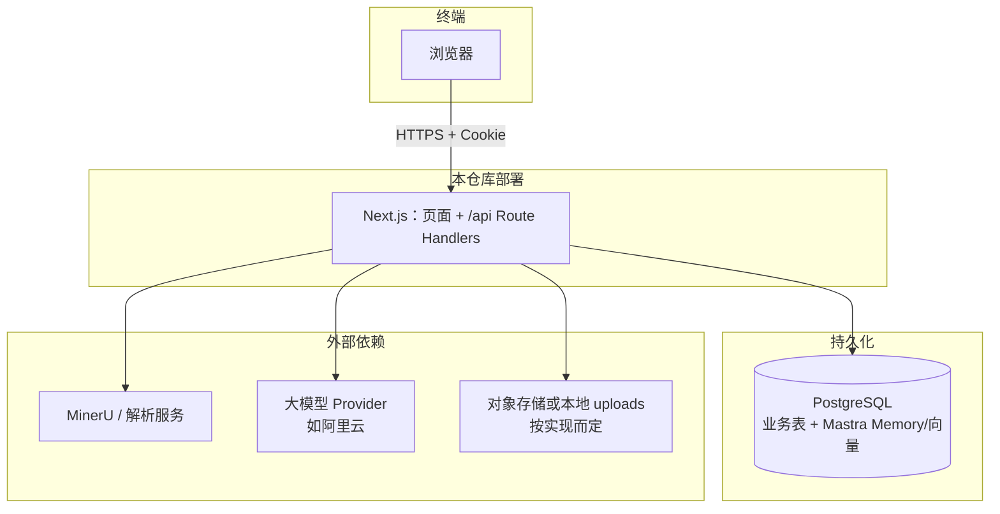
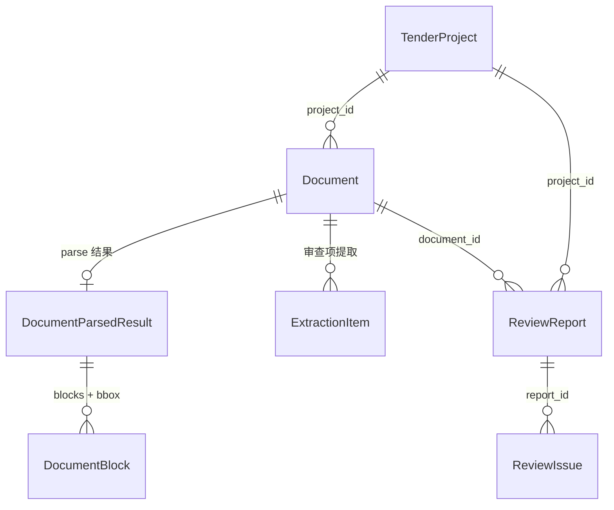
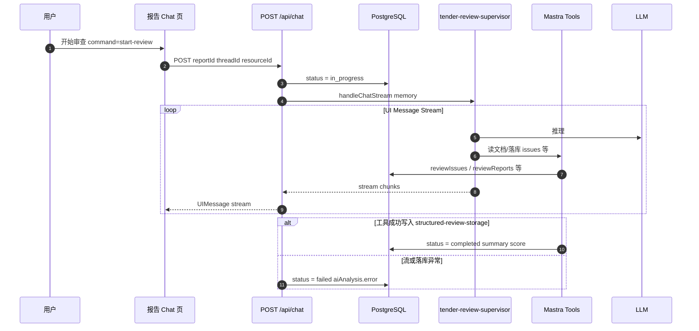
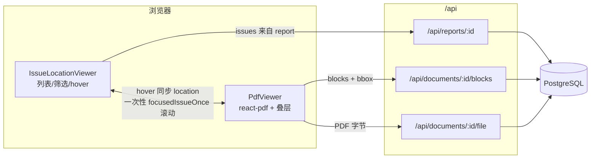

# 2026 CICC 智能体开放主题黑客松挑战赛  
# 设计文档（RFC）


---

## 1、RFC 文档结构

| 章节 | 标题 |
|------|------|
| 1 | RFC 文档结构 |
| 2 | 团队成员 |
| 3 | 项目进度 |
| 4 | 项目概述 |
| 5 | 背景与动机 |
| 6 | 详细设计 |

---

## 2、团队成员

| 姓名 | 队内角色 | 
|------|----------|
| 李灿 | 队长 | 
| 李晓婷 | 队员 | 
| 黄德凯 | 队员 | 
| 谭嘉伟 | 队员 | 
| 刘哲 | 队员 | 

---

## 3、项目进度

| 阶段 | 计划内容 | 当前状态 | 备注 |
|------|----------|----------|------|
| 需求与方案 | RFC、架构定稿 | **已完成** | |
| 环境搭建 | DB、MinerU、模型 Key | **已完成** | |
| 核心功能 | 上传、解析、审查 Chat、报告与定位 | **已完成** | |
| 演示与视频 | 按赛方要求录制与提交 | **已完成** | |

**当前进度概述**：需求与方案、运行环境、解析与审查主链路、报告与 PDF 问题定位、演示材料均已闭环；开放赛题下的智能体招投标审查场景可完整演示。

---

## 4、项目概述

### 4.1 核心目标与范围

本项目 **智能投标预审智能体**：支持招标文件与投标文件上传、高精度解析（MinerU）、结构化区块与坐标、审查项提取、基于多智能体（Mastra）的 AI 合规审查与对话、问题清单与 PDF 精确定位、组织级统计分析。数据按 **组织（orgId）** 多租户隔离。

**能力边界**：PDF 侧重点是 **预览与问题叠层定位**，不承担「编辑并写回 PDF 文件」；问题在线编辑若上线需另行接口与权限设计。

### 4.2 参赛赛题说明

本队参加 **开放赛题**（非组委会指定命题），方向为 **智能体多智能体编排 + 招投标／资格预审文档的智能解析与合规审查**，与作品功能一致。

### 4.3 运行环境与依赖版本

以下为本项目在开发/部署时的 **推荐/验证环境**；演示视频与答辩 PPT 中建议展示一致的版本信息。

| 类别 | 项 | 版本或说明 |
|------|----|------------|
| **操作系统** | 开发与运行 | 以 macOS / Linux 服务器为佳；Windows 可用 WSL2 跑 PostgreSQL 与 Node |
| **硬件** | CPU / 内存 | 建议 ≥ 8GB 内存；大 PDF 与模型推理时建议 16GB+ |
| **运行时** | Node.js | **20.x LTS**（推荐 20+） |
| **包管理器** | npm | 随 Node 自带的 npm；或使用 pnpm/yarn 需团队自行对齐 lockfile |
| **数据库** | PostgreSQL | **15+** |
| **Web 框架** | Next.js | ^15.2.0（App Router） |
| **UI** | React | ^19.0.0 |
| **ORM** | Drizzle ORM | ^0.38.0 |
| **鉴权** | NextAuth | v5 beta |
| **AI 编排** | Mastra | `@mastra/core` ^1.32.1 等 |
| **文档解析** | MinerU | 以外部 HTTP 服务提供；`MINERU_API_URL` 可指向本机 Docker 或云端 |
| **大模型** | 阿里云 DashScope 等 | 通过环境变量 `ALIBABA_API_KEY` / `ALIBABA_CODING_PLAN_API_KEY` 等配置 |

**关键命令**：

```bash
npm install
# 准备 .env：配置数据库 URL、鉴权密钥、模型与 MinerU 等环境变量
npm run db:push        # 或 db:migrate，依团队规范
npm run dev            # 默认监听 0.0.0.0，便于局域网联调
```

---

## 5、背景与动机

### 5.1 背景

招投标与资格预审场景中，投标文件需对照招标文件 **强制性条款**、格式、签章与图表进行人工核对，工作量大、耗时长，且易遗漏。传统规则引擎难以覆盖自然语言表述与跨段落、跨表格的合规关系。

### 5.2 要解决的问题

1. **非结构化文档的可机读化**：将 PDF 转为带 **页码、区块、bounding box** 的结构化结果，支撑精确定位。  
2. **审查项可提取、可执行**：从招标文件抽取待审查条目，与投标文件内容对照。  
3. **「人机协同」审查体验**：用 **多智能体编排** 自动产出问题清单、摘要与评分，人在 **报告详情 + PDF 工作台** 上复核、跳转定位。  
4. **多租户与可运营**：项目、文档、报告、问题与统计均按组织隔离，便于企业内推广。

### 5.3 如何满足需求

- 解析：**MinerU** 管道接入，产出区块与坐标。  
- 审查：**Mastra** Supervisor + 子 Agent + Tools，经 **`POST /api/chat`** 完成流式审查与落库。  
- 落库：结构化工具写入 `reviewReports` / `reviewIssues`，状态机：`pending` → `in_progress` → `completed` | `failed`。  
- 体验：**react-pdf** 渲染 + 问题列表联动、一次性滚动定位，避免 hover 抢滚动。

---

## 6、详细设计

### 6.1 系统分层与上下文



### 6.2 核心领域关系（简化）

详细字段以线上数据表定义为准。



### 6.3 报告审查主路径（Chat + Mastra）



### 6.4 问题定位工作台数据流（报告详情页）

路径：`/projects/[projectId]/reports/[reportId]`（非 Chat 页）。



**关键交互要点**：`reviewIssues.location`（页码、`blockIndex`、可选 `bbox`）；无 bbox 时用 `documentBlocks` 兜底；`focusedIssueOnce` 避免持续抢滚动；高亮层级：选中 > hover > 其他问题。

### 6.5 AI 子系统（Mastra）

- **Supervisor**：`tender-review-supervisor`（Chat 默认 `agentId`）。  
- **子 Agent**：如 `extraction-agent`、`image-review-agent`、`report-generation-agent` 等，以 Mastra 实例内注册为准。  
- **落库工具**：`structured-review-storage-tool`、`issue-storage-tool`、`resolve-review-report-tool` 等。  
- **模型路由**：若配置了 `ALIBABA_CODING_PLAN_API_KEY` 则走 `alibaba-coding-plan-cn/*`，否则走 `alibaba-cn/*` 并需 `ALIBABA_API_KEY`。  
- **Memory**：`thread` / `resource` 常与 `reportId` 对齐；历史经 `GET /api/chat?threadId=&resourceId=` 恢复。

### 6.6 主链路 API 索引（摘录）

完整路由以实际部署中的接口注册为准。

| 方法 | 路径 | 说明 |
|------|------|------|
| * | `/api/auth/[...nextauth]` | 会话 |
| GET/POST | `/api/projects`、`/api/projects/[id]` | 项目 |
| GET/POST | `/api/projects/[id]/documents` | 文档 |
| GET/POST | `/api/documents/[id]/parse` | 解析 |
| GET/POST | `/api/documents/[id]/extract` | 审查项提取 |
| **POST/GET** | **`/api/chat`** | **审查主入口**（流式；GET 拉历史） |
| GET | `/api/analytics/overview`、`/top`、`/trends` | 统计 |
| GET | `/api/mineru/health` | MinerU 健康检查 |

### 6.7 报告状态机（`review_status`）

| 状态 | 含义 |
|------|------|
| `pending` | 待审查 |
| `in_progress` | 审查中 |
| `completed` | 已完成 |
| `failed` | 失败（含 `aiAnalysis.error`） |

### 6.8 安全与非功能摘要

- 多租户：查询必须带组织/项目权限过滤。  
- 文件访问：`/api/documents/[id]/file` 等需校验用户对文档的访问权限。  
- 密钥：数据库、`AUTH_SECRET`、模型 API Key 仅环境变量注入。  
- 局域网调试：`next dev -H 0.0.0.0` 时注意 `AUTH_URL` 与 `NEXT_PUBLIC_APP_URL` 与 Cookie 一致。

### 6.9 关键模块职责

| 模块 | 职责 |
|------|------|
| Chat 审查路由 | 流式审查主入口 |
| PDF Viewer 组件 | PDF 渲染与高亮叠层 |
| 问题定位 Viewer | 问题列表与 PDF 联动 |
| 数据持久化层 | 业务表与类型定义 |
| Mastra 目录 | Agent、工具、模型与记忆配置 |

---

