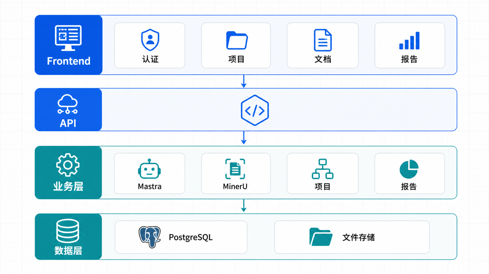
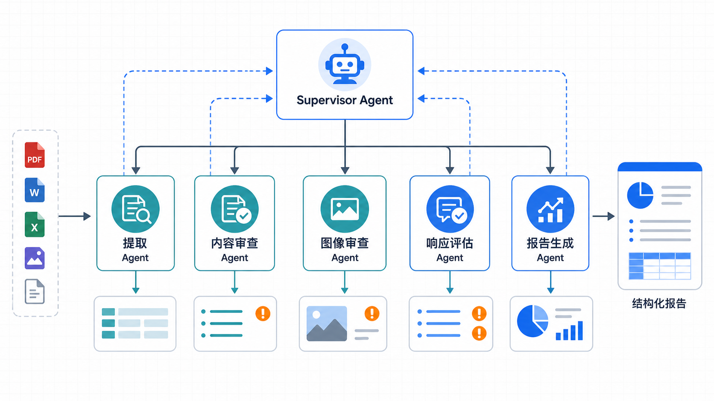
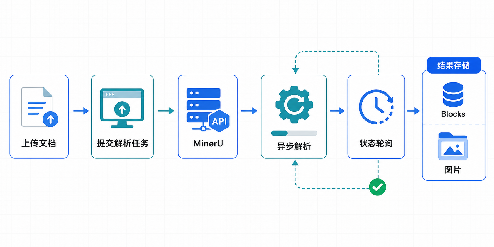

# 智能投标预审智能体 系统架构文档

## 1. 系统概述

### 1.1 项目背景

智能投标预审智能体 是一个 AI 驱动的招标文件智能审查与分析平台，旨在帮助招标机构和评审专家高效完成招标文件的合规性审查、智能评分与报告生成。

### 1.2 核心业务场景

| 场景 | 描述 |
|------|------|
| **招标文件管理** | 上传、解析、管理招标文件和法律文件 |
| **审查项提取** | 从招标文件中自动提取强制性审查项和响应项 |
| **投标文件审查** | AI 多智能体协作完成投标文件的全面审查 |
| **问题定位** | 精确定位到文档页码、区块、坐标的问题标注 |
| **报告生成** | 自动生成结构化审查报告，含评分和建议 |

### 1.3 系统定位

- **目标用户**：招标机构、评审专家、供应商
- **核心价值**：提升审查效率、降低人工成本、确保合规性
- **技术特色**：Mastra 多智能体协作、MinerU 高精度文档解析

---

## 2. 整体架构

### 2.1 分层架构图



```
┌─────────────────────────────────────────────────────────────────┐
│                        前端层 (Frontend)                          │
│  ┌─────────────┐ ┌─────────────┐ ┌─────────────┐ ┌─────────────┐ │
│  │  认证页面   │ │  项目管理   │ │  文档管理   │ │  审查报告   │ │
│  │ (auth)     │ │ (projects) │ │ (documents)│ │ (reports)   │ │
│  └─────────────┘ └─────────────┘ └─────────────┘ └─────────────┘ │
│  Next.js 15 App Router + React 19 + shadcn/ui + Tailwind CSS     │
└─────────────────────────────────────────────────────────────────┘
                              │
                              ▼
┌─────────────────────────────────────────────────────────────────┐
│                        API层 (API Routes)                         │
│  ┌─────────────┐ ┌─────────────┐ ┌─────────────┐ ┌─────────────┐ │
│  │  认证API    │ │  项目API    │ │  文档API    │ │  AI接口     │ │
│  │ /api/auth  │ │ /api/projects│ /api/documents│ /api/chat    │ │
│  └─────────────┘ └─────────────┘ └─────────────┘ └─────────────┘ │
│  Next.js Route Handlers + Drizzle ORM                           │
└─────────────────────────────────────────────────────────────────┘
                              │
                              ▼
┌─────────────────────────────────────────────────────────────────┐
│                        业务层 (Business)                          │
│  ┌─────────────────────────────────────────────────────────────┐ │
│  │              Mastra 多智能体系统                              │ │
│  │  ┌───────────┐ ┌───────────┐ ┌───────────┐ ┌───────────────┐ │ │
│  │  ┌───────────┐ ┌───────────┐ ┌───────────┐ ┌───────────────┐ │ │
│  │  │ Supervisor │ │ Extraction │ │ Tender    │ │ Report Gen   │ │ │
│  │  │ Agent     │ │ Agent     │ │ Review    │ │ Agent        │ │ │
│  │  └───────────┘ └───────────┘ └───────────┘ └───────────────┘ │ │
│  │  ┌───────────┐                                                │ │
│  │  │ Image     │                                                │ │
│  │  │ Review    │                                                │ │
│  │  └───────────┘                                                │ │
│  └─────────────────────────────────────────────────────────────┘ │
│  ┌─────────────────────────────────────────────────────────────┐ │
│  │              MinerU 文档解析服务                              │ │
│  │  - PDF/Office 文档解析                                       │ │
│  │  - 表格/图片/公式提取                                         │ │
│  │  - 异步任务处理                                               │ │
│  └─────────────────────────────────────────────────────────────┘ │
└─────────────────────────────────────────────────────────────────┘
                              │
                              ▼
┌─────────────────────────────────────────────────────────────────┐
│                        数据层 (Data)                              │
│  ┌─────────────────────┐ ┌─────────────────────┐                 │
│  │    PostgreSQL       │ │   Mastra Storage    │                 │
│  │  - Drizzle ORM      │ │   - Memory          │                 │
│  │  - 业务数据持久化    │ │   - Vector Store    │                 │
│  └─────────────────────┘ └─────────────────────┘                 │
│  ┌─────────────────────┐                                         │
│  │    文件存储         │                                         │
│  │  - uploads/ 目录    │                                         │
│  │  - 解析图片存储      │                                         │
│  └─────────────────────┘                                         │
└─────────────────────────────────────────────────────────────────┘
```

### 2.2 技术栈清单

| 层级 | 技术 | 版本 | 说明 |
|------|------|------|------|
| **前端框架** | Next.js | ^15.2.0 | App Router 模式 |
| **UI框架** | React | ^19.0.0 | Server/Client Components |
| **类型系统** | TypeScript | ^5.7.0 | 严格模式 |
| **UI组件库** | shadcn/ui | - | 基于 Radix UI |
| **样式方案** | Tailwind CSS | ^3.4.19 | Notion 风格设计系统 |
| **图标库** | Lucide React | ^0.468.0 | SVG 图标 |
| **数据库** | PostgreSQL | - | 主数据存储 |
| **ORM** | Drizzle ORM | ^0.38.0 | 类型安全的 SQL 查询 |
| **AI框架** | Mastra | ^1.32.1 | 多智能体架构 |
| **AI SDK** | Vercel AI SDK | ^6.0.176 | 流式响应处理 |
| **认证** | NextAuth.js | ^5.0.0-beta.25 | JWT 策略 |
| **文档解析** | MinerU API | 外部服务 | PDF/Office 高精度解析 |
| **PDF渲染** | react-pdf | ^9.2.1 | 前端 PDF 预览 |

---

## 3. 前端架构

### 3.1 App Router 路由结构

```
src/app/
├── layout.tsx                    # 根布局 (AuthProvider)
├── page.tsx                      # 首页 (重定向)
│
├── (auth)/                       # 认证路由组
│   ├── layout.tsx                # 认证布局
│   ├── login/page.tsx            # 登录页
│   ├── register/page.tsx         # 注册页
│   ├── forgot-password/page.tsx  # 密码重置请求
│   └── reset-password/page.tsx   # 密码重置执行
│
├── (dashboard)/                  # 主应用路由组
│   ├── layout.tsx                # Dashboard 布局 (侧边栏)
│   ├── page.tsx                  # Dashboard 主页
│   ├── analytics/page.tsx        # 统计分析
│   ├── chat/page.tsx             # AI 助手对话
│   │
│   ├── projects/                 # 项目管理
│   │   ├── page.tsx              # 项目列表 (Server Component)
│   │   ├── new/page.tsx          # 创建项目
│   │   └── [projectId]/          # 项目详情
│   │       ├── page.tsx          # 项目概览
│   │       ├── settings/page.tsx # 项目设置
│   │       ├── documents/        # 文档管理
│   │       │   ├── page.tsx      # 文档列表
│   │       │   ├── upload/page.tsx # 文档上传
│   │       │   └── [documentId]/page.tsx # 文档详情
│   │       └── reports/          # 审查报告
│   │           ├── page.tsx      # 报告列表
│   │           └── new/page.tsx  # 创建报告
│   │
│   └── reports/                  # 报告管理
│       └── [reportId]/           # 报告详情
│           ├── page.tsx          # 报告概览
│           └── chat/page.tsx     # AI 审查对话
│
└── api/                          # API 路由 (详见 API 文档)
```

### 3.2 路由组划分

| 路由组 | 用途 | 特点 |
|--------|------|------|
| `(auth)` | 认证相关页面 | 共享简约布局，无需侧边栏 |
| `(dashboard)` | 主应用界面 | 共享侧边栏布局，需认证 |

### 3.3 组件层次结构

```
src/components/
├── providers/                    # Context Providers
│   └ auth-provider.tsx          # NextAuth SessionProvider
│
├── ui/                           # shadcn/ui 基础组件
│   ├── button.tsx                # 按钮 (变体: default/destructive/outline/ghost/link)
│   ├── input.tsx                 # 输入框
│   ├── textarea.tsx              # 多行文本
│   ├── select.tsx                # 下拉选择
│   ├── card.tsx                  # 卡片容器
│   ├── dialog.tsx                # 弹窗对话框
│   ├── toast.tsx                 # 消息提示
│   ├── badge.tsx                 # 标签徽章
│   ├── progress.tsx              # 进度条
│   ├── tabs.tsx                  # 标签页切换
│   ├── accordion.tsx             # 手风琴折叠
│   ├── dropdown-menu.tsx         # 下拉菜单
│   └ scroll-area.tsx            # 滚动区域
│   └ tooltip.tsx                # 工具提示
│   └ spinner.tsx                # 加载动画
│   └ avatar.tsx                 # 用户头像
│   └ truncated-text.tsx         # 文本截断
│   └ copy-button.tsx            # 复制按钮
│
├── chat/                         # AI 对话组件
│   ├── conversation.tsx          # 对话容器 (stick-to-bottom)
│   ├── message.tsx               # 消息展示
│   ├── prompt-input.tsx          # 输入区域
│   ├── response.tsx              # AI 响应渲染
│   ├── reasoning.tsx             # 推理过程展示
│   ├── tool-call.tsx             # 工具调用可视化
│   ├── suggestions.tsx           # 建议快捷选项
│   ├── loader.tsx                # 加载状态
│   └ shimmer.tsx                # shimmer 动画
│
├── document/                     # 文档组件
│   └ pdf-viewer.tsx             # PDF 预览 (区块高亮)
│
├── review/                       # 审查组件
│   └ issue-location-viewer.tsx  # 问题定位展示
```

### 3.4 状态管理策略

| 类型 | 方案 | 用途 |
|------|------|------|
| **认证状态** | NextAuth SessionProvider | 用户会话、角色、组织信息 |
| **组件状态** | React useState/useReducer | 本地状态管理 |
| **Toast 状态** | 自定义 useToast hook | 全局消息通知 |
| **数据获取** | Server Components + fetch | 服务端数据加载 |
| **轮询刷新** | useEffect + setInterval | 处理状态同步 |

---

## 4. 后端架构

### 4.1 API 层设计

API 采用 Next.js Route Handlers 模式，按业务模块组织：

```
src/app/api/
├── auth/                         # 认证模块
│   ├── [...nextauth]/route.ts    # NextAuth 入口
│   ├── register/route.ts         # 用户注册
│   ├── forgot-password/route.ts  # 密码重置请求
│   └ reset-password/route.ts    # 密码重置执行
│
├── projects/                     # 项目模块
│   ├── route.ts                  # 项目 CRUD
│   └ [projectId]/               # 项目子资源
│       ├── route.ts              # 项目详情/更新/删除
│       ├── documents/route.ts    # 项目文档管理
│       └ reports/route.ts       # 项目报告管理
│
├── documents/                    # 文档模块
│   ├── route.ts                  # 文档列表
│   └ [documentId]/              # 文档子资源
│       ├── route.ts              # 文档详情/删除
│       ├── parse/route.ts        # MinerU 解析
│       ├── extract/route.ts      # AI 提取
│       ├── blocks/route.ts       # 文档区块
│       └ file/route.ts          # 文件下载
│
├── reports/                      # 报告模块
│   ├── route.ts                  # 报告列表
│   └ [reportId]/                # 报告子资源
│       ├── route.ts              # 报告详情/删除
│       └ issues/route.ts        # 问题管理
│
├── chat/route.ts                 # AI 对话
├── ai/review/route.ts            # AI 审查
├── mastra/                       # Mastra 接口
│   ├── review/route.ts           # Mastra 审查
│   └ stream/route.ts            # Mastra 流式
│
├── analytics/                    # 统计模块
│   ├── overview/route.ts         # 统计总览
│   ├── top/route.ts              # 排行数据
│   └ trends/route.ts            # 趋势数据
│
├── upload/route.ts               # 文件上传
├── mineru/health/route.ts        # MinerU 健康检查
├── cron/check-documents/route.ts # 定时任务
├── images/[documentId]/[filename]/route.ts # 解析图片
```

### 4.2 服务层划分

```
src/lib/
├── auth/config.ts                # 认证配置 (NextAuth v5)
├── ai/
│   ├── mineru-client.ts          # MinerU API 客户端
│   └ review-agent.ts            # 基于规则的审查 Agent
├── db/
│   ├── schema.ts                 # Drizzle Schema (781行)
│   └ client.ts                  # 数据库连接
├── email/
│   └ send-password-reset.ts     # 密码重置邮件
├── storage/
│   └ image-storage.ts           # MinerU 图片存储
├── tasks/
│   ├── cron-manager.ts           # 定时任务管理
│   └ document-status-checker.ts # 文档状态检查
├── ui/
│   ├── format.ts                 # 格式化工具
│   └ labels.ts                  # UI 标签定义
└ utils.ts                       # 通用工具 (cn函数等)
```

---

## 5. AI 系统架构

### 5.1 Mastra 多智能体框架

Mastra 是本系统的 AI 核心，采用多智能体协作模式：

```
src/mastra/
├── index.ts                      # Mastra 主配置
├── storage.ts                    # PostgreSQL 存储 (Memory + Vector)
├── config/
│   └ review.ts                  # 模型配置 + 提示词
│
├── agents/                       # 5 个智能体
│   ├── tender-review-supervisor.ts  # 总协调者 (Supervisor)
│   ├── extraction-agent.ts          # 文档提取专家
│   ├── tender-review-agent.ts       # 投标文件审查专家
│   ├── image-review-agent.ts        # 图像风险分析专家
│   └ report-generation-agent.ts    # 报告生成专家
│
├── tools/                        # 9 个工具
│   ├── document-reader-tool.ts      # 文档读取 (分页)
│   ├── extraction-item-storage-tool.ts # 审查项存储
│   ├── get-review-items-tool.ts     # 获取审查项
│   ├── get-standard-documents-parse-status-tool.ts # 标准文档状态
│   ├── get-report-tool.ts           # 获取报告
│   ├── resolve-review-report-tool.ts # 解析/创建报告
│   ├── structured-review-storage-tool.ts # 结构化审查结果存储
│   ├── issue-storage-tool.ts        # 问题存储
│   └ get-image-risks-tool.ts       # 图片风险查询
│
└── mcp/                          # MCP 连接
```

### 5.2 Agent 职责划分

| Agent | 职责 | 输入 | 输出 |
|-------|------|------|------|
| **tender-review-supervisor** | 总协调者，按固定流程委托子智能体 | projectId, reportId, bidDocumentId | 完成摘要 |
| **extraction-agent** | 从招标文件提取 5 类固定审查项 | projectId, documentId | extractionItems[] |
| **tender-review-agent** | 基于审查项逐条审查投标文件 | reportId, projectId, bidDocumentId | reviewItemResults[], issues[] |
| **image-review-agent** | 分析图片暗标风险（Logo、水印等） | 图片内容 | hasRisk, riskType, riskText |
| **report-generation-agent** | 汇总结果并结构化落库 | reportId, projectId | report (completed), issues[], results[] |

### 5.3 多智能体协作流程



```
┌─────────────────────────────────────────────────────────────┐
│                    Supervisor Agent                          │
│  ┌────────────────────────────────────────────────────────┐ │
│  │ Step 0: get-standard-documents-parse-status             │ │
│  │ Step 1: 检查提取状态，判断是否需要委托 extraction-agent   │ │
│  └────────────────────────────────────────────────────────┘ │
│                           │                                  │
│                           ▼                                  │
│  ┌────────────────────────────────────────────────────────┐ │
│  │ Step 3: 委托 extraction-agent 补齐审查项（如需要）      │ │
│  └────────────────────────────────────────────────────────┘ │
│                           │                                  │
│                           ▼                                  │
│  ┌───────────────────┐                                    │
│  │ Step 4:           │                                    │
│  │ tender-review     │                                    │
│  │ agent             │                                    │
│  │ (投标文件审查)    │                                    │
│  └───────────────────┘                                    │
│                           │                                  │
│                           ▼                                  │
│  ┌────────────────────────────────────────────────────────┐ │
│  │ Step 5: report-generation-agent 汇总并落库              │ │
│  │ - issues[]                                             │ │
│  │ - reviewItemResults[]                                  │ │
│  │ - imageRisks[]                                          │ │
│  │ - score, recommendation                                │ │
│  └────────────────────────────────────────────────────────┘ │
│                           │                                  │
│                           ▼                                  │
│  ┌────────────────────────────────────────────────────────┐ │
│  │ Step 6: 确认 report 状态更新为 completed                │ │
│  └────────────────────────────────────────────────────────┘ │
└─────────────────────────────────────────────────────────────┘
```

### 5.4 Memory 系统设计

```typescript
// 共享 Memory 配置
const defaultMemory = new Memory({
  storage: pgStore,          // PostgreSQL 存储
  vector: pgVector,          // 向量存储（语义搜索）
  options: {
    lastMessages: 20,        // 最近 20 条消息作为上下文
    workingMemory: {
      enabled: true,
      scope: "resource",     // 资源级工作记忆
    },
    generateTitle: true,     // 自动生成对话标题
  },
});
```

### 5.5 模型配置

```typescript
export const reviewModelConfig = {
  defaultModel: "alibaba-coding-plan-cn/qwen3.6-plus",
  reasoningModel: "alibaba-coding-plan-cn/glm-5",
  maxSteps: 30,
} as const;
```

---

## 6. MinerU 文档解析集成

### 6.1 MinerU 服务架构

MinerU 是外部高精度文档解析服务，支持：

- PDF/Word/Excel/PPT 等格式
- 表格、图片、公式提取
- 异步任务处理
- 坐标定位信息

### 6.2 解析流程



```
┌────────────┐     ┌────────────┐     ┌────────────┐
│ 文件上传   │────▶│ MinerU API │────▶│ 异步解析   │
│ /api/upload│     │ 提交任务   │     │ (后台处理) │
└────────────┘     └────────────┘     └────────────┘
                                              │
                                              ▼
┌────────────┐     ┌────────────┐     ┌────────────┐
│ 结果存储   │◀────│ 状态轮询   │◀────│ 解析完成   │
│ blocks/图片│     │ parse API  │     │ 返回结果   │
└────────────┘     └────────────┘     └────────────┘
```

### 6.3 MinerU 客户端配置

```typescript
// src/lib/ai/mineru-client.ts
const MINERU_API_URL = process.env.MINERU_API_URL;
const MINERU_BACKEND = process.env.MINERU_BACKEND || "pipeline";
```

---

## 7. 数据架构

### 7.1 PostgreSQL 数据持久化

- **主数据库**: PostgreSQL
- **ORM**: Drizzle ORM (类型安全)
- **连接**: `DATABASE_URL` 环境变量
- **迁移**: Drizzle Kit 管理

### 7.2 Mastra Storage

Mastra 共享主数据库，用于：

- **Memory**: 对话历史、工作记忆
- **Vector Store**: 语义搜索向量

```typescript
// src/mastra/storage.ts
export const pgStore = new PostgresStore({
  connectionString: process.env.DATABASE_URL!,
});

export const pgVector = new PgVector({
  connectionString: process.env.DATABASE_URL!,
});
```

### 7.3 文件存储

- **位置**: `uploads/` 目录
- **内容**: 原始文档 + MinerU 解析图片
- **访问**: `/api/images/[documentId]/[filename]`

---

## 8. 集成架构

### 8.1 认证集成 (NextAuth v5)

```typescript
// src/lib/auth/config.ts
providers: [
  GitHub({ clientId, clientSecret }),
  Google({ clientId, clientSecret }),
  Credentials({ email, password }),
]
session: { strategy: "jwt", maxAge: 30 * 24 * 60 * 60 }
callbacks: {
  jwt: (token) => { id, role, orgId },
  session: (session, token) => { user.id, role, orgId },
}
```

### 8.2 MinerU 集成

| 环境变量 | 说明 |
|---------|------|
| `MINERU_API_URL` | MinerU API 地址 |
| `MINERU_BACKEND` | 后端类型 (pipeline/s3) |

### 8.3 AI 模型集成

| 模型 | 用途 |
|------|------|
| `qwen3.6-plus` | 默认审查模型 |
| `glm-5` | 推理模型 |

---

## 9. 架构演进规划

### 9.1 当前实现状态

| 模块 | 状态 | 说明 |
|------|------|------|
| 认证系统 | ✅ 完成 | NextAuth v5, OAuth + Credentials |
| 项目管理 | ✅ 完成 | CRUD + 状态流转 |
| 文档管理 | ✅ 完成 | MinerU 解析 + 状态追踪 |
| AI 审查系统 | ✅ 完成 | 7 Agent 协作 |
| 报告生成 | ✅ 完成 | 结构化结果 + 问题定位 |
| PDF 预览 | 🔄 完善 | 区块高亮优化 |
| 统计分析 | ✅ 完成 | 基础统计 API |

### 9.2 待完善事项

1. PDF 预览组件高亮定位优化
2. 审查报告详情页完善
3. 问题定位可视化增强
4. Docker 部署方案
5. 测试覆盖完善

### 9.3 演进方向

- 支持更多文档格式
- Agent 智能化增强
- 实时协作审查
- 移动端适配
