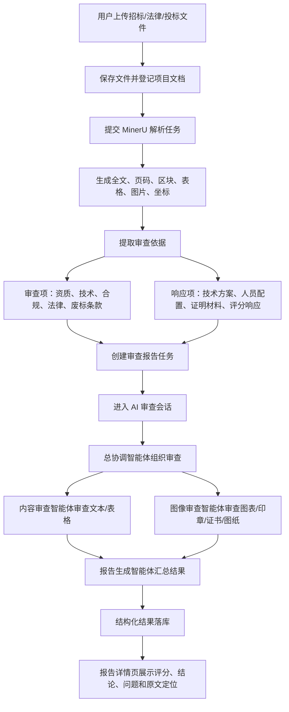
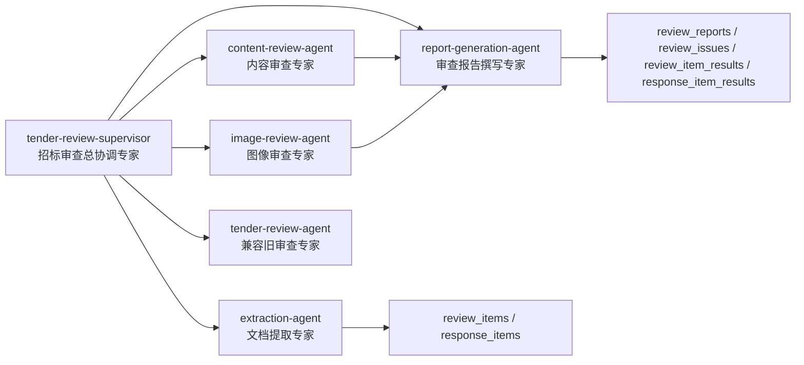
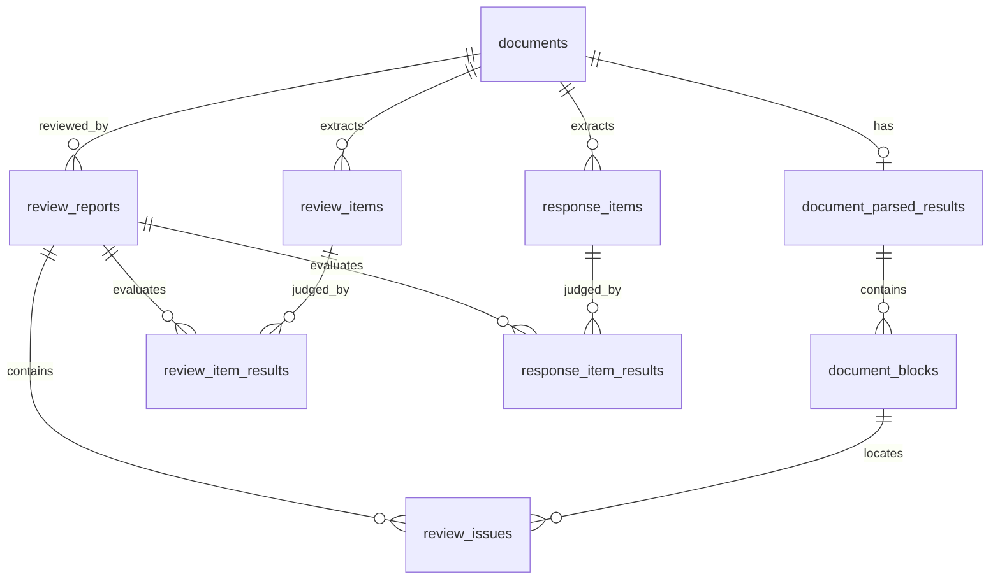
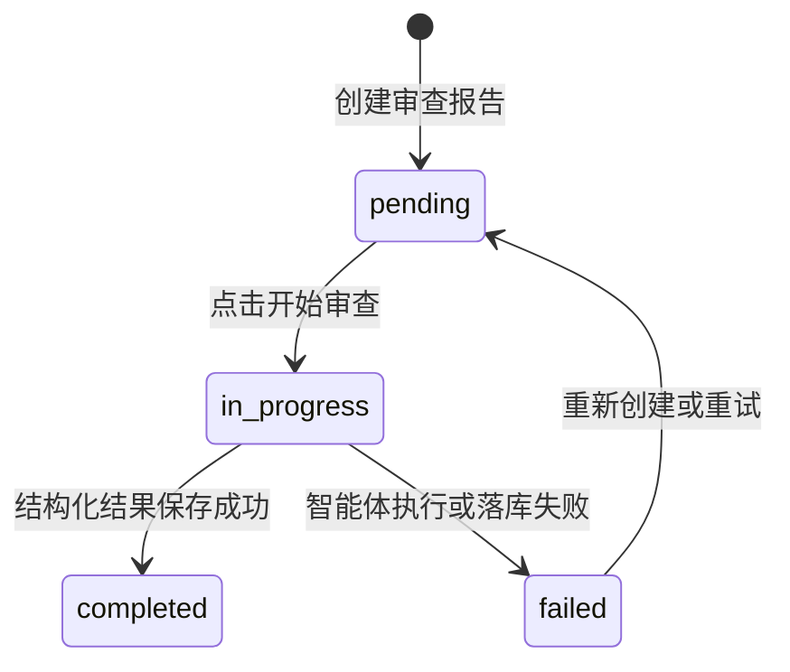

# 智能审查流程设计文档

版本：v1.0  
日期：2026-05-09  
适用范围：智能投标预审智能体当前代码实现

## 1. 背景与目标

当前项目面向招投标资料的智能审查场景，核心目标是把传统人工审查中的“查条款、看响应、找风险、写报告”转化为一套可追踪、可定位、可复核的智能化流程。

系统不直接把文件交给大模型一次性判断，而是先将文档拆解成结构化数据，再由多个智能体分别承担提取、审查、汇总等角色，最终生成带评分、问题清单、整改建议和原文定位的审查报告。

业务目标包括：

- 降低人工审查的初筛成本。
- 自动识别资质、技术、合规、法律、响应完整性等风险。
- 将每个问题定位到具体页码、区块和原文片段。
- 输出可供业务人员复核和整改跟踪的结构化审查报告。
- 为后续扩展规则库、人工复核、模型升级和审计留痕提供数据基础。

## 2. 当前实现概览

当前智能审查主链路采用 Mastra 多智能体架构，入口是 `/api/chat`，由 `tender-review-supervisor` 作为总协调智能体组织审查流程。

仓库中仍保留早期的关键词规则审查实现 `src/lib/ai/review-agent.ts`，其逻辑基于关键词和正则匹配进行扣分，当前更适合作为历史实现、兼容逻辑或后续兜底方案参考；主业务流程已经转向“文档解析 + 审查项提取 + 多智能体审查 + 结构化报告落库”。

## 3. 端到端业务流程

### 3.1 文件上传

用户上传 PDF、Word、Excel 等招投标资料，系统将文件保存到本地 `uploads` 目录，并返回文件名、存储路径、大小和 MIME 类型。随后业务页面会将这些文件信息登记到项目文档表中。

相关实现：

- `src/app/api/upload/route.ts`
- `src/lib/db/schema.ts` 中的 `documents`

### 3.2 文档解析

文档解析由 MinerU 完成。系统将文件提交给 MinerU 异步任务接口，解析完成后将结果转换为内部统一结构。

解析结果包括：

- 文档全文 `fullText`
- 文档页数 `totalPages`
- 文档区块 `documentBlocks`
- 区块类型，如文本、标题、表格、图片等
- 页码、区块序号、bbox 坐标
- Markdown 内容、结构化内容、MinerU 原始返回
- 图片数据和图片路径

业务价值是把原始文件变成可审查、可定位、可复核的数据结构。后续所有问题都可以回溯到具体页码、区块和文本片段。

相关实现：

- `src/app/api/documents/[documentId]/parse/route.ts`
- `src/lib/ai/mineru-client.ts`
- `src/lib/db/schema.ts` 中的 `documentParsedResults`、`documentBlocks`

### 3.3 审查依据提取

文档解析完成后，系统可触发 `extraction-agent` 从招标文件和法律文件中提取结构化依据。

提取结果分为两类：

- 审查项：用于判断投标文件或招标文件是否存在合规风险。例如资质要求、技术要求、法律条款、关键条款、废标条款等。
- 响应项：用于判断投标文件是否充分响应招标要求。例如技术方案、人员配置、设备清单、证明材料、评分响应等。

不同文档类型的提取策略：

| 文档类型 | 提取策略 |
| --- | --- |
| 招标文件 `tender_doc` | 提取审查项和响应项 |
| 法律文件 `legal_doc` | 重点提取法律合规类审查项 |
| 投标文件 `bid_doc` | 当前暂不提取，主要作为后续审查对象 |

相关实现：

- `src/app/api/documents/[documentId]/extract/route.ts`
- `src/mastra/agents/extraction-agent.ts`
- `src/mastra/tools/review-item-storage-tool.ts`
- `src/mastra/tools/response-item-storage-tool.ts`
- `src/lib/db/schema.ts` 中的 `reviewItems`、`responseItems`

### 3.4 创建审查任务

用户在项目中选择已解析文档后，系统创建一条审查报告记录，状态为 `pending`。创建完成后页面跳转到审查会话页。

当前已停用旧的直接生成报告接口：

- `src/app/api/reports/[reportId]/generate/route.ts` 返回 410
- 提示用户改用 `/api/chat` 发起审查会话

相关实现：

- `src/app/api/projects/[projectId]/reports/route.ts`
- `src/app/(dashboard)/projects/[projectId]/reports/new/page.tsx`
- `src/lib/db/schema.ts` 中的 `reviewReports`

### 3.5 启动智能审查会话

用户进入报告会话页后点击“开始审查”，前端向 `/api/chat` 发送 `start-review` 指令，并将 `reportId` 作为会话线程和资源标识。

后端处理逻辑：

1. 校验登录态。
2. 如果是 `start-review` 指令，将报告状态更新为 `in_progress`。
3. 调用 Mastra 的 `tender-review-supervisor`。
4. 使用 `reportId` 绑定 memory thread 和 resource。
5. 流式返回智能体执行过程和工具调用信息。
6. 如果执行失败，将报告状态更新为 `failed`。

相关实现：

- `src/app/api/chat/route.ts`
- `src/app/(dashboard)/reports/[reportId]/chat/page.tsx`

## 4. 多智能体职责设计

### 4.1 总协调智能体

`tender-review-supervisor` 是完整审查任务的组织者。

职责：

- 读取项目、报告和目标文档上下文。
- 检查标准文档解析状态。
- 读取已提取的审查项和响应项。
- 协调内容审查、图像审查和报告生成。
- 维护审查过程 memory，支持同一报告会话持续追问和补充指令。

相关实现：

- `src/mastra/agents/tender-review-supervisor.ts`

### 4.2 文档提取智能体

`extraction-agent` 负责把招标文件和法律文件中的条款转成结构化审查依据。

职责：

- 识别章节结构和条款编号。
- 区分强制性审查项与投标响应项。
- 提取要求、后果、法律依据、位置和置信度。
- 将结果写入 `review_items` 和 `response_items`。

相关实现：

- `src/mastra/agents/extraction-agent.ts`

### 4.3 内容审查智能体

`content-review-agent` 负责审查文本和表格内容。

重点识别：

- 资质门槛是否过高。
- 技术参数是否具有品牌或型号指向性。
- 评分标准是否清晰、公平。
- 合同条款是否存在责任不对等。
- 是否存在地域限制、排斥性条款、倾向性描述。
- 投标文件是否响应已提取的响应项。

输出内容包括合规状态、问题列表、严重程度、整改建议和置信度。

相关实现：

- `src/mastra/agents/content-review-agent.ts`

### 4.4 图像审查智能体

`image-review-agent` 负责审查图像类区块。

审查对象：

- 图表
- 流程图
- 印章
- 签名
- 技术图纸
- 资质证书图片

当前设计重点是识别图像清晰度、图文一致性、印章签名规范性、技术图纸完整性、证书有效性等问题。

相关实现：

- `src/mastra/agents/image-review-agent.ts`

### 4.5 报告生成智能体

`report-generation-agent` 负责把各类审查结果汇总成最终审查报告。

输出结构：

- 审查摘要
- 问题清单
- 严重程度分类
- 综合评分
- 建议结论
- 整改建议
- 审查项通过情况
- 响应项覆盖情况

相关实现：

- `src/mastra/agents/report-generation-agent.ts`
- `src/mastra/tools/structured-review-storage-tool.ts`

### 4.6 兼容旧审查智能体

`tender-review-agent` 是保留的旧审查智能体，当前可用于兼容早期 `/api/ai/review` 或辅助审查场景。

早期纯规则审查逻辑在 `src/lib/ai/review-agent.ts`，主要基于关键词和正则识别风险，并按严重程度扣分。该逻辑不是当前主流程，但可作为兜底规则库或后续“规则 + 模型”混合审查的基础。

相关实现：

- `src/mastra/agents/tender-review-agent.ts`
- `src/lib/ai/review-agent.ts`

## 5. 数据流与落库设计

### 5.1 核心表说明

| 表 | 业务含义 |
| --- | --- |
| `documents` | 项目文档，记录文件类型、解析状态、提取状态 |
| `document_parsed_results` | 文档解析主结果，保存全文和结构化内容 |
| `document_blocks` | 文档区块，保存页码、区块序号、内容、bbox 坐标 |
| `review_items` | 从招标/法律文件中提取出的审查依据 |
| `response_items` | 从招标文件中提取出的投标响应要求 |
| `review_reports` | 一次审查任务和最终报告主表 |
| `review_issues` | 审查发现的问题清单 |
| `review_item_results` | 每个审查项的通过、失败、需人工复核结果 |
| `response_item_results` | 每个响应项的已响应、部分响应、未响应、不适用结果 |

### 5.2 报告状态流转

## 6. 审查输出设计

最终报告需要满足业务人员直接复核的要求，不只输出一段自然语言总结。

### 6.1 报告摘要

报告摘要应说明：

- 本次审查的文档和项目范围。
- 总体风险判断。
- 发现问题数量。
- 重点风险类别。
- 建议处理方式。

### 6.2 综合评分

当前报告表支持 `aiScore`，分值范围建议保持为 0-100。

评分应综合考虑：

- 严重问题数量。
- 重要问题数量。
- 审查项失败比例。
- 响应项未响应或部分响应比例。
- 需人工复核项数量。
- 关键条款是否存在直接否决风险。

### 6.3 建议结论

系统当前支持三类结论：

| 结论 | 含义 |
| --- | --- |
| `pass` | 未发现明显阻断性问题，可通过 |
| `revise` | 存在需整改问题，建议修改后复核 |
| `fail` | 存在严重风险或关键项不满足，不建议通过 |

### 6.4 问题清单

每个问题至少包含：

- 问题类别
- 严重程度：`critical`、`major`、`minor`、`suggestion`
- 问题标题
- 问题描述
- 整改建议
- 原文位置：页码、区块序号、bbox、文本片段、高亮文本
- 发现来源：哪个智能体或检查点发现

### 6.5 原文定位

报告详情页会读取问题的 `location`，结合文档区块和 PDF 预览能力，实现点击问题后跳转到原文页码和对应位置。

相关实现：

- `src/app/(dashboard)/reports/[reportId]/page.tsx`
- `src/components/review/issue-location-viewer.tsx`
- `src/components/document/pdf-viewer.tsx`

## 7. 当前接口与页面清单

| 模块 | 路径 | 说明 |
| --- | --- | --- |
| 文件上传 | `POST /api/upload` | 保存原始文件 |
| 文档解析 | `POST /api/documents/[documentId]/parse` | 提交 MinerU 解析任务 |
| 解析状态 | `GET /api/documents/[documentId]/parse` | 查询解析进度并保存结果 |
| 审查依据提取 | `POST /api/documents/[documentId]/extract` | 调用 extraction-agent |
| 提取结果查询 | `GET /api/documents/[documentId]/extract` | 查询审查项和响应项 |
| 创建审查任务 | `POST /api/projects/[projectId]/reports` | 创建 pending 报告 |
| 审查会话 | `POST /api/chat` | 调用 supervisor 开始或继续审查 |
| 会话历史 | `GET /api/chat?reportId=...` | 获取 Mastra memory 历史 |
| 报告详情 | `GET /api/reports/[reportId]` | 获取报告、问题和结构化统计 |
| 问题列表 | `GET /api/reports/[reportId]/issues` | 获取问题清单 |

## 8. 当前实现风险与待完善事项

### 8.1 Mastra 配置文件缺失

多个智能体从 `src/mastra/config/review` 导入模型配置、提示词和 working memory 模板，但当前 `src/mastra/config` 目录为空。该问题可能导致编译或运行失败。

涉及导入项包括：

- `reviewModelConfig`
- `supervisorInstructions`
- `extractionInstructions`
- `contentReviewInstructions`
- `reportGenerationInstructions`
- 多个 working memory template

建议优先补齐 `src/mastra/config/review.ts` 或 `src/mastra/config/review/index.ts`，并统一模型、提示词、评分原则和输出约束。

### 8.2 审查主流程依赖智能体自主编排

当前 `/api/chat` 直接调用 supervisor，由智能体根据提示和工具自主推进流程。业务上灵活，但工程上需要更强约束：

- 明确每一步必须调用哪些工具。
- 明确失败重试策略。
- 明确不同文档类型的审查分支。
- 明确报告必须落库后才算审查完成。

后续可考虑引入显式 workflow，将“读取文档、读取审查项、内容审查、图像审查、报告保存”固化为可观测步骤。

### 8.3 图像审查能力尚未完全工具化

`image-review-agent` 已定义职责，但工具列表为空，尚未接入实际图像读取、OCR 校验或视觉模型工具。当前图像审查能力更偏设计态，需要补充图像访问和模型输入链路。

### 8.4 旧规则审查与新智能体审查尚未融合

旧的 `review-agent.ts` 包含可解释的规则项、扣分逻辑和建议模板。新流程主要依赖大模型语义判断。后续可以把旧规则沉淀为规则库，与智能体输出交叉验证，形成“规则命中 + 模型判断 + 人工复核”的组合审查机制。

### 8.5 人工复核闭环仍需加强

数据库已经支持 `isResolved`、`resolvedBy`、`manualScore`、`manualAnalysis`、`finalScore` 等字段，但当前流程重点仍是 AI 自动生成报告。后续应补齐人工确认、驳回、整改完成、最终评分等业务闭环。

## 9. 建议演进方向

短期优先级：

1. 补齐 Mastra 审查配置文件，确保主流程可稳定运行。
2. 固化 supervisor 的最小必经步骤，避免审查流程漂移。
3. 完善报告落库失败时的错误提示和重试机制。
4. 将旧规则审查逻辑整理为可复用规则库。

中期优先级：

1. 增加显式审查 workflow，提升可观测性和可测试性。
2. 增加图像审查工具链，支持真实图片读取和视觉模型输入。
3. 增加审查项、响应项的人工确认功能。
4. 增加报告导出、整改跟踪和版本留痕。

长期优先级：

1. 建立行业规则库和项目类型模板。
2. 支持多模型交叉审查和置信度校验。
3. 支持审查历史统计、风险趋势分析和机构级审计报表。
4. 形成“招标文件审查、投标响应审查、专家复核、整改闭环”的完整业务产品。

