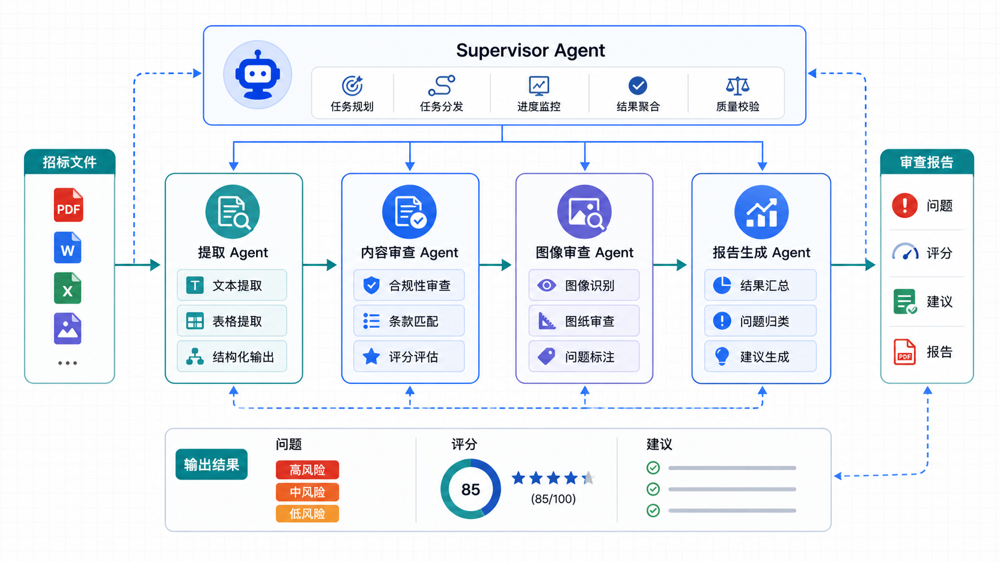
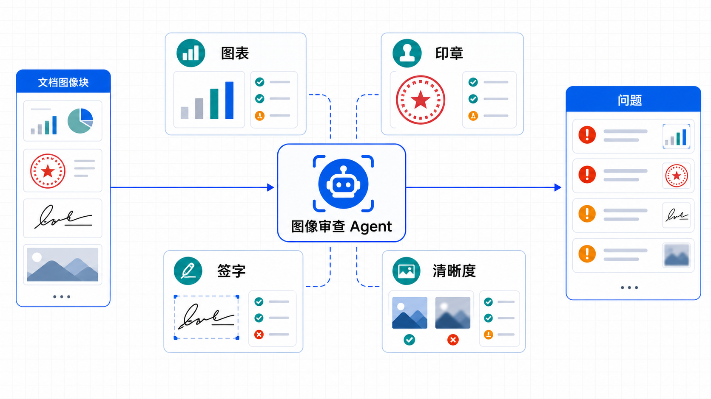

# 智能招标审查平台 AI审查系统文档

## 1. 系统概述

### 1.1 技术架构

智能招标审查平台的 AI审查系统基于 **Mastra** 多智能体框架构建，采用 **Supervisor-Agent** 协作模式：

| 项目 | 技术 |
|------|------|
| **AI框架** | Mastra v1.32.1 |
| **AI SDK** | Vercel AI SDK v6.0.176 |
| **模型服务** | 阿里云 DashScope (Qwen/GLM) |
| **存储** | PostgreSQL (Memory + Vector) |

### 1.2 核心能力

- **审查项提取**：从招标文件自动提取强制性条款
- **响应项提取**：识别要求投标人说明的内容
- **内容审查**：验证投标文件是否满足审查项要求
- **图像审查**：检查图表、印章等图像内容
- **报告生成**：汇总结果并结构化落库

---

## 2. 智能体架构

### 2.1 Agent 职责矩阵

| Agent | 角色 | 职责 | 输入 | 输出 |
|-------|------|------|------|------|
| **tender-review-supervisor** | 总协调者 | 协调专业团队完成完整审查 | projectId, reportId, docType | 完成状态, score, recommendation |
| **extraction-agent** | 文档提取专家 | 提取审查项和响应项 | projectId, documentId, docType | reviewItems[], responseItems[] |
| **content-review-agent** | 内容审查专家 | 审查文本/表格合规性 | documentId, reviewItems | issues[], reviewItemResults[] |
| **image-review-agent** | 图像审查专家 | 审查图表/印章内容 | documentId, blocks | issues[] |
| **tender-response-agent** | 响应评估专家 | 评估响应项覆盖情况 | documentId, responseItems | responseItemResults[] |
| **report-generation-agent** | 报告生成专家 | 汇总结果并落库 | 各Agent结果 | 完整审查报告 |
| **tender-review-agent** | 旧版智能体 | 单智能体审查 (兼容) | projectId, documentId | report |

### 2.2 协作流程图



```
┌─────────────────────────────────────────────────────────────────┐
│                    Supervisor Agent                              │
│  ┌─────────────────────────────────────────────────────────────┐ │
│  │ Step 0: 检查 report 状态和标准文件解析状态                    │ │
│  │ Step 1: 获取审查依据 (reviewItems / responseItems)          │ │
│  │ Step 2: 检查前置依赖                                        │ │
│  └─────────────────────────────────────────────────────────────┘ │
│                           │                                      │
│                           ▼                                      │
│  ┌─────────────────────────────────────────────────────────────┐ │
│  │ Step 3: extraction-agent 补齐审查项（如需要）                │ │
│  │ 输出: reviewItems[], responseItems[]                        │ │
│  └─────────────────────────────────────────────────────────────┘ │
│                           │                                      │
│                           ▼                                      │
│  ┌───────────────────┐          ┌───────────────────┐           │
│  │ content-review    │─────────▶│ image-review      │           │
│  │ agent             │          │ agent             │           │
│  │ 输出: issues[]    │          │ 输出: issues[]    │           │
│  │ reviewItemResults │          │                   │           │
│  └───────────────────┘          └───────────────────┘           │
│                           │                                      │
│                           ▼                                      │
│  ┌─────────────────────────────────────────────────────────────┐ │
│  │ Step 6: report-generation-agent                             │ │
│  │ 汇总结果: issues[], reviewItemResults[], responseItemResults │ │
│  │ 计算 score, recommendation                                  │ │
│  │ 调用 structuredReviewStorageTool 落库                       │ │
│  └─────────────────────────────────────────────────────────────┘ │
│                           │                                      │
│                           ▼                                      │
│  ┌─────────────────────────────────────────────────────────────┐ │
│  │ Step 7: report 状态更新为 completed                         │ │
│  └─────────────────────────────────────────────────────────────┘ │
└─────────────────────────────────────────────────────────────────┘
```

---

## 3. 智能体详细说明

### 3.1 tender-review-supervisor (总协调者)

**配置**：
```typescript
{
  id: "tender-review-supervisor",
  name: "招标审查总协调专家",
  model: "alibaba-coding-plan-cn/qwen3.6-plus",
  memory: {
    lastMessages: 20,
    workingMemory: { enabled: true, scope: "resource" },
    generateTitle: true
  }
}
```

**协调子智能体**：
- extractionAgent
- contentReviewAgent
- imageReviewAgent
- reportGenerationAgent

**持有工具**：
- documentReaderTool
- getReviewItemsTool
- getResponseItemsTool
- getStandardDocumentsParseStatusTool

**执行规则**：
1. 外部入口只有 chat，它是唯一 chat-facing 主智能体
2. 检查标准文件（tender_doc、legal_doc）的解析状态
3. 如果审查项不足，委托 extraction-agent 补齐
4. 委托 content-review-agent 审查文本/表格
5. 委托 image-review-agent 审查图像内容
6. 委托 report-generation-agent 汇总结果
7. 确认 report 状态为 completed

### 3.2 extraction-agent (文档提取专家)

**配置**：
```typescript
{
  id: "extraction-agent",
  name: "文档提取专家",
  model: "alibaba-coding-plan-cn/qwen3.6-plus"
}
```

**持有工具**：
- documentReaderTool
- reviewItemStorageTool
- responseItemStorageTool

**提取策略**：

#### 招标文件 (tender_doc)
- 提取 **审查项** + **响应项**
- 识别章节：资质要求、技术规范、评分标准、合同条款、废标条款
- 判断标准：
  - **审查项**：包含"必须"、"应当"、"废标"等强制性关键词
  - **响应项**：包含"投标人应提供"、"需提交"等响应要求关键词

#### 法律文件 (legal_doc)
- 只提取 **审查项**（法律合规条款）
- 重点：违约责任、付款条款、保修条款、争议解决

#### 投标文件 (bid_doc)
- 不提取，用于审查验证

**输出格式**：
```json
{
  "success": true,
  "documentId": "...",
  "reviewItems": [
    {
      "itemType": "资质要求",
      "itemNo": "第三章第5条",
      "title": "投标人资质等级要求",
      "description": "...",
      "location": { "pageNumber": 5, "blockIndex": 12 },
      "consequence": "废标",
      "legalReference": "..."
    }
  ],
  "responseItems": [...]
}
```

### 3.3 content-review-agent (内容审查专家)

**职责**：对文本和表格 blocks 做实质审查

**输出**：
- blockReviews[] - 区块审查结果
- issues[] - 发现的问题
- reviewItemResults[] - 审查项结果
- responseItemResults[] - 响应项结果

**审查项结果状态**：
- `pass` - 满足要求
- `fail` - 不满足要求
- `needs_manual_review` - 需人工复核

### 3.4 image-review-agent (图像审查专家)



**职责**：审查图表/印章等图像内容

**审查重点**：
- 印章是否完整、有效
- 图表数据是否准确
- 签字是否规范
- 图像是否清晰可辨

### 3.5 report-generation-agent (报告生成专家)

**职责**：汇总多智能体结果并结构化落库

**输入**：
- content-review-agent 结果
- image-review-agent 结果

**输出**：
```json
{
  "reportId": "...",
  "score": 85,
  "recommendation": "pass",
  "summary": "审查摘要",
  "issues": [...],
  "reviewItemResults": [...],
  "responseItemResults": [...]
}
```

**关键规则**：
- issues 必须是 JSON 数组
- reviewItemResults 必须是 JSON 数组
- responseItemResults 必须是 JSON 数组
- 落库成功后报告状态自动设为 completed

---

## 4. 工具定义

### 4.1 工具清单

| 工具 | 文件 | 用途 |
|------|------|------|
| documentReaderTool | `document-reader-tool.ts` | 分页读取文档内容 |
| reviewItemStorageTool | `review-item-storage-tool.ts` | 存储审查项 |
| responseItemStorageTool | `response-item-storage-tool.ts` | 存储响应项 |
| getReviewItemsTool | `get-review-items-tool.ts` | 获取项目审查项 |
| getResponseItemsTool | `get-response-items-tool.ts` | 获取项目响应项 |
| structuredReviewStorageTool | `structured-review-storage-tool.ts` | 结构化审查结果存储 |
| issueStorageTool | `issue-storage-tool.ts` | 问题存储 |
| getReportTool | `get-report-tool.ts` | 获取报告信息 |
| resolveReviewReportTool | `resolve-review-report-tool.ts` | 解析/创建报告 |
| getStandardDocumentsParseStatusTool | `get-standard-documents-parse-status-tool.ts` | 标准文档状态 |
| documentAnalysisTool | `document-analysis-tool.ts` | 文档分析 |
| checkpointDesignTool | `checkpoint-design-tool.ts` | 检查点设计 |
| reviewItemQueryTool | `review-item-query-tool.ts` | 审查项查询 |
| responseItemQueryTool | `response-item-query-tool.ts` | 响应项查询 |
| getDocumentInfoTool | `get-document-info-tool.ts` | 文档信息获取 |

### 4.2 documentReaderTool (文档读取)

**输入参数**：
```typescript
{
  projectId: string,      // 项目ID
  documentId: string,     // 文档ID
  startPage?: number,     // 起始页码
  endPage?: number        // 结束页码
}
```

**输出**：
```typescript
{
  totalPages: number,
  blocks: [
    {
      id: string,
      pageNumber: number,
      blockIndex: number,
      blockType: "text" | "table" | "title" | "paragraph",
      content: string,
      bbox: { x0, y0, x1, y1 }
    }
  ]
}
```

**用途**：
- 分页获取文档 blocks
- 大文档 (>50页) 支持分页参数
- 支持 Supervisor 和各专业 Agent 获取数据

### 4.3 structuredReviewStorageTool (结构化存储)

**输入参数**：
```typescript
{
  reportId: string,
  score: number,              // 0-100
  recommendation: "pass" | "fail" | "revise",
  summary: string,
  issues: [
    {
      category: string,
      severity: "critical" | "major" | "minor" | "suggestion",
      title: string,
      description: string,
      location: { pageNumber, blockIndex, textSnippet },
      checkpointId?: string
    }
  ],
  reviewItemResults: [
    {
      reviewItemId: string,
      status: "pass" | "fail" | "needs_manual_review",
      reason: string,
      evidenceBlockIds?: string[]
    }
  ],
  responseItemResults: [
    {
      responseItemId: string,
      status: "answered" | "partially_answered" | "unanswered",
      reason: string,
      evidenceBlockIds?: string[]
    }
  ]
}
```

**关键规则**：
- 所有数组参数必须是纯 JSON 数组，不要字符串化
- reviewItemId 可使用序号（如 "1", "2"），工具会自动映射
- 成功落库后报告状态自动更新为 completed

---

## 5. Memory 系统

### 5.1 配置

```typescript
const defaultMemory = new Memory({
  storage: pgStore,          // PostgreSQL 存储
  vector: pgVector,          // 向量存储
  options: {
    lastMessages: 20,        // 最近 20 条消息作为上下文
    workingMemory: {
      enabled: true,
      scope: "resource",     // 资源级工作记忆
    },
    generateTitle: true,     // 自动生成对话标题
  },
});
```

### 5.2 Working Memory Template

**Supervisor**：
```
项目审查上下文：
- 项目名称：{{projectName}}
- 项目类型：{{projectType}}
- 审查偏好：{{preferences}}
- 已完成审查次数：{{reviewCount}}
- 常见问题类型：{{commonIssues}}
```

**Extraction Agent**：
```
提取配置：
- 提取模式：{{extractionMode}}
- 文档类型：{{docType}}
- 重点关注类型：{{focusTypes}}
- 提取历史：{{extractionHistory}}
```

**Content Review Agent**：
```
审查上下文：
- 报告ID：{{reportId}}
- 项目ID：{{projectId}}
- 文档ID：{{documentId}}
- 文档类型：{{docType}}
- 当前审查页码：{{currentPage}}
```

---

## 6. 模型配置

### 6.1 当前配置

```typescript
export const reviewModelConfig = {
  defaultModel: "alibaba-coding-plan-cn/qwen3.6-plus",
  reasoningModel: "alibaba-coding-plan-cn/glm-5",
  maxSteps: 30,
} as const;
```

### 6.2 模型说明

| 模型 | 用途 | 特点 |
|------|------|------|
| **qwen3.6-plus** | 默认审查模型 | 通义千问，中文理解强 |
| **glm-5** | 推理模型 | GLM 系列，推理能力强 |

### 6.3 API Key 配置

```bash
# 阿里云 DashScope API Key
ALIBABA_API_KEY=sk-xxx
```

---

## 7. 审查流程详细说明

### 7.1 审查项提取流程

```
Step 1: 读取文档 blocks
        documentReaderTool(projectId, documentId)
        ↓
Step 2: 识别章节结构
        - 资质要求章节 → 审查项
        - 技术规范章节 → 审查项 + 响应项
        - 评分标准章节 → 响应项
        ↓
Step 3: 遍历 blocks，识别条款
        - 条款编号模式：第X章、第X条、X.X.X
        - 强制性关键词："必须"、"应当"、"废标"
        ↓
Step 4: 判断条款类型
        - 审查项：强制要求 + 后果描述
        - 响应项：要求投标人说明 + 格式要求
        ↓
Step 5: 提取详细信息
        - itemType / responseType
        - itemNo, title, description
        - location (页码、区块、bbox)
        - consequence / responseRequirements
        ↓
Step 6: 存储到数据库
        reviewItemStorageTool / responseItemStorageTool
```

### 7.2 审查执行流程

```
Step 1: 获取审查依据
        getReviewItemsTool(projectId) → reviewItems[]
        getResponseItemsTool(projectId) → responseItems[]
        ↓
Step 2: 读取投标文件
        documentReaderTool(projectId, bidDocumentId)
        ↓
Step 3: 逐项审查
        对每个 reviewItem:
          - 查找投标文件中的证据
          - 判断是否满足要求
          - 记录结果: pass / fail / needs_manual_review
          - 发现问题时创建 issue
        ↓
Step 4: 评估响应度
        对每个 responseItem:
          - 检查是否有响应内容
          - 判断响应完整性
          - 记录结果: answered / partially_answered / unanswered
        ↓
Step 5: 计算评分
        - 统计 pass/fail 数量
        - 考虑 issue 严重程度
        - 计算 0-100 分
        ↓
Step 6: 生成建议
        - 有严重问题 → fail
        - 有一般问题 → revise
        - 全部通过 → pass
        ↓
Step 7: 落库存储
        structuredReviewStorageTool()
```

---

## 8. 与现有文档的关系

**docs/智能审查流程设计文档.md** 已详细描述了：
- 审查流程设计
- 数据模型设计
- 检查点分类
- 审查项/响应项定义

本文档侧重于：
- Mastra 技术架构实现
- Agent 职责划分与协作
- 工具定义与使用
- Memory 和模型配置

两份文档互为补充，共同构成 AI 审查系统的完整技术说明。
