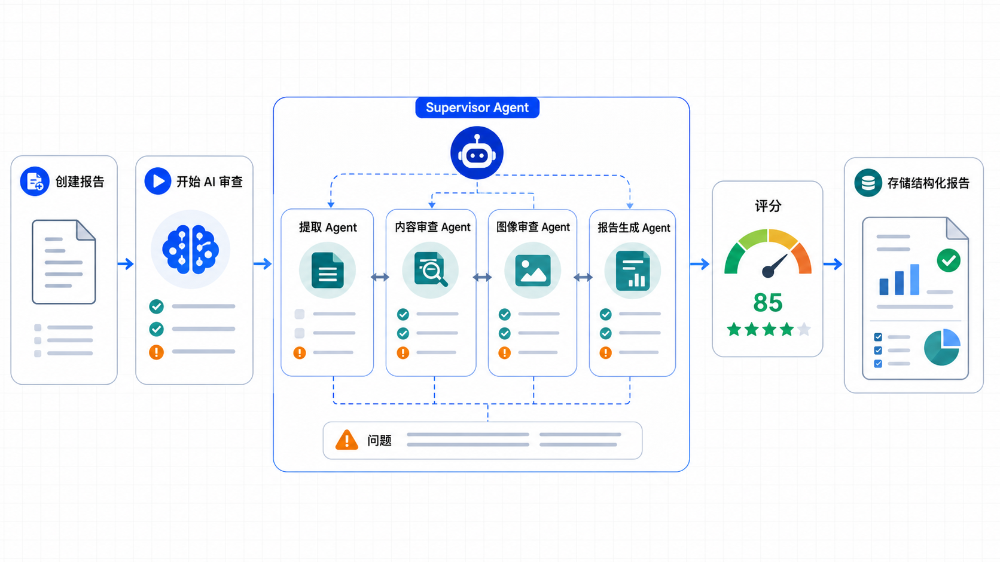

# 报告生成流程

## 1. 流程概述

报告生成是 AI 审查的核心流程，通过多智能体协作完成投标文件的全面审查。

### 1.1 审查类型

| 类型 | 说明 |
|------|------|
| **审查项验证** | 验证是否满足强制性条款 |
| **响应项评估** | 检查投标响应的完整性 |
| **问题定位** | 发现问题并精确定位 |

### 1.2 输出内容

- 审查项结果列表
- 响应项结果列表
- 发现的问题列表
- 综合评分和建议

---

## 2. 审查报告创建

### 2.1 创建报告

```
POST /api/projects/[projectId]/reports

请求体:
{
  "documentId": "bid-document-id",
  "targetDocType": "bid_doc"
}

响应:
{
  "success": true,
  "reportId": "uuid",
  "status": "pending"
}
```

### 2.2 报告状态流转

```
pending → in_progress → completed/failed
```

| 状态 | 说明 |
|------|------|
| `pending` | 待审查，等待启动 |
| `in_progress` | 审查中，Agent 正在处理 |
| `completed` | 已完成，结果已存储 |
| `failed` | 失败，审查出错 |

---

## 3. AI 审查会话启动

### 3.1 Chat 端点

```
POST /api/chat

请求体:
{
  "message": "请审查投标文件，projectId=xxx, documentId=xxx",
  "reportId": "report-uuid"
}

响应: SSE 流式
data: {"type":"text","content":"正在启动审查..."}
data: {"type":"agent","name":"tender-review-supervisor"}
data: {"type":"tool","name":"getReviewItemsTool"}
data: {"type":"result","reportId":"xxx","score":85}
```

### 3.2 Supervisor 接收任务

```typescript
// Supervisor Agent 处理流程

Step 0: 检查前置状态
- 检查标准文件（tender_doc/legal_doc）解析状态
- 检查审查项是否已提取

Step 1: 获取审查依据
- getReviewItemsTool(projectId)
- getResponseItemsTool(projectId)

Step 2: 检查前置依赖
- 如果审查项不足，委托 extraction-agent 补齐
- 如果标准文件未解析，提示用户

Step 3-7: 协调专业智能体完成审查
```

---

## 4. 多智能体协作流程

### 4.1 协作流程图



```
┌─────────────────────────────────────────────────────────────────┐
│                    Supervisor Agent                              │
│                                                                  │
│  ┌─────────────────────────────────────────────────────────────┐ │
│  │ Step 3: extraction-agent                                     │ │
│  │ 输入: projectId, documentId, docType                         │ │
│  │ 输出: extractionItems[]                                      │ │
│  │ 工具: documentReaderTool, extractionItemStorageTool          │ │
│  └─────────────────────────────────────────────────────────────┘ │
│                           │                                      │
│                           ▼                                      │
│  ┌─────────────────────────────────────────────────────────────┐ │
│  │ Step 4: tender-review-agent                                   │ │
│  │ 输入: reportId, projectId, bidDocumentId                      │ │
│  │ 输出: reviewItemResults[], issues[]                           │ │
│  │ 工具: documentReaderTool, structuredReviewStorageTool         │ │
│  └─────────────────────────────────────────────────────────────┘ │
│                           │                                      │
│                           ▼                                      │
│  ┌─────────────────────────────────────────────────────────────┐ │
│  │ Step 5: report-generation-agent                              │ │
│  │ 输入: 各 Agent 结果                                           │ │
│  │ 输出: score, recommendation, summary                         │ │
│  │ 工具: structuredReviewStorageTool                             │ │
│  └─────────────────────────────────────────────────────────────┘ │
│                           │                                      │
│                           ▼                                      │
│  ┌─────────────────────────────────────────────────────────────┐ │
│  │ Step 6: 报告状态更新为 completed                              │ │
│  └─────────────────────────────────────────────────────────────┘ │
└─────────────────────────────────────────────────────────────────┘
```

---

## 5. 审查项结果生成

### 5.1 reviewItemResults 结构

```typescript
{
  reportId: string,
  reviewItemResults: [
    {
      reviewItemId: string,
      status: "pass" | "fail" | "needs_manual_review",
      reason: string,
      evidenceBlockIds: string[],
      confidence: number
    }
  ]
}
```

### 5.2 结果状态说明

| 状态 | 说明 | 处理方式 |
|------|------|---------|
| `pass` | 通过 | 不创建 issue |
| `fail` | 不通过 | 创建 issue，记录位置 |
| `needs_manual_review` | 需复核 | 创建 issue，标记需人工 |

---

## 6. 图片风险结果

图像审查智能体分析文档中的图片，返回风险结果：

```typescript
{
  hasRisk: boolean,
  riskType: "企业Logo" | "水印" | "其他项目名称",
  riskText: string,
  confidence: number,
  pageNumber: number,
}
```

---

## 7. 问题定位机制

### 7.1 Issue 结构

```typescript
{
  reportId: string,
  blockId: string,            // 关联区块
  checkpointId: string,       // 关联审查项
  agentSource: string,        // 来源智能体
  category: string,           // 问题类别
  severity: "critical" | "major" | "minor" | "suggestion",
  title: string,
  description: string,
  location: {
    pageNumber: number,
    blockIndex: number,
    bbox: { x0, y0, x1, y1 },
    textSnippet: string,
    highlightText: string
  },
  suggestion: string          // 修复建议
}
```

### 7.2 严重程度说明

| 程度 | 说明 | 影响 |
|------|------|------|
| `critical` | 严重问题 | 必整改，否则废标 |
| `major` | 重要问题 | 需关注说明 |
| `minor` | 轻微问题 | 可接受瑕疵 |
| `suggestion` | 建议 | 改进建议 |

---

## 8. 评分计算

### 8.1 评分规则

```typescript
// 基础评分计算
function calculateScore(results) {
  const total = results.reviewItemResults.length;
  const passed = results.filter(r => r.status === 'pass').length;
  const failed = results.filter(r => r.status === 'fail').length;
  const needsReview = results.filter(r => r.status === 'needs_manual_review').length;

  // 基础分数
  let score = (passed / total) * 100;

  // 减分项
  score -= failed * 10;  // 每个 fail -10
  score -= needsReview * 5;  // 每个 needs_manual_review -5

  // 严重问题额外减分
  const criticalIssues = issues.filter(i => i.severity === 'critical').length;
  score -= criticalIssues * 20;

  return Math.max(0, Math.min(100, score));
}
```

### 8.2 建议生成规则

```typescript
function generateRecommendation(score, issues) {
  const hasCritical = issues.some(i => i.severity === 'critical');
  const hasMajor = issues.some(i => i.severity === 'major');

  if (hasCritical || score < 50) {
    return 'fail';  // 不通过
  }
  if (hasMajor || score < 80) {
    return 'revise';  // 需整改
  }
  return 'pass';  // 通过
}
```

---

## 9. 结果存储

### 9.1 structuredReviewStorageTool

```typescript
// report-generation-agent 调用
await structuredReviewStorageTool.execute({
  reportId: report.id,
  score: 85,
  recommendation: 'pass',
  summary: '审查摘要...',
  issues: [
    {
      category: '资质要求',
      severity: 'major',
      title: '资质证书不完整',
      description: '缺少安全生产许可证',
      location: { pageNumber: 3, blockIndex: 12 }
    }
  ],
  reviewItemResults: [
    { reviewItemId: '1', status: 'pass', reason: '满足要求' }
  ],
});
```

### 9.2 存储成功后

- 报告状态更新为 `completed`
- 完成时间记录
- 用户可在前端查看完整结果

---

## 10. 前端报告展示

### 10.1 报告详情页

```
/reports/[reportId]
├── 基本信息
│   ├── 报告状态
│   ├── 评分
│   ├── 建议
│   └── 完成时间
├── 问题列表
│   ├── 按严重程度分组
│   ├── 点击定位到 PDF
│   ├── 修复建议
├── 审查项结果
│   ├── 通过/不通过统计
│   ├── 详细列表
├── 响应项结果
│   ├── 响应度统计
│   ├── 详细列表
```

### 10.2 AI 审查对话页

```
/reports/[reportId]/chat
├── 对话历史
│   ├── Supervisor 进度汇报
│   ├── 工具调用展示
│   ├── 最终结果摘要
├── 输入区域
│   ├──追问问题
│   ├── 请求补充分析
```

### 10.3 PDF 问题定位

```typescript
// PDF 预览 + 问题高亮
<PDFViewer document={document}>
  {issues.map(issue => (
    <IssueHighlight
      key={issue.id}
      pageNumber={issue.location.pageNumber}
      bbox={issue.location.bbox}
      severity={issue.severity}
    />
  ))}
</PDFViewer>
```

---

## 11. 完整审查流程示例

```
1. 用户上传招标文件（tender_doc）
   → MinerU 解析
   → extraction-agent 提取审查项

2. 用户上传投标文件（bid_doc）
   → MinerU 解析

3. 用户创建审查报告
   POST /api/projects/{id}/reports
   → 返回 reportId

4. 用户启动 AI 审查
   POST /api/chat
   → Supervisor 开始协调

5. Supervisor 协调流程
   → extraction-agent (如需要)
   → tender-review-agent
   → image-review-agent
   → report-generation-agent

6. 报告生成完成
   → status = "completed"
   → 用户查看报告详情

7. 用户查看问题定位
   → PDF 预览 + 高亮
   → 点击问题跳转

8. 用户追问或补充分析
   → 继续对话
   → 更新报告内容
```
