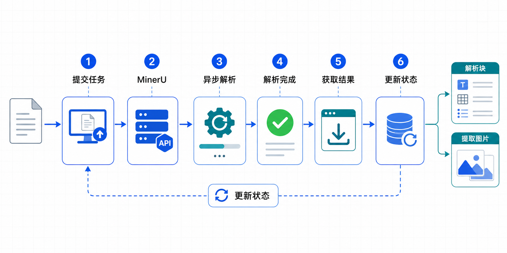
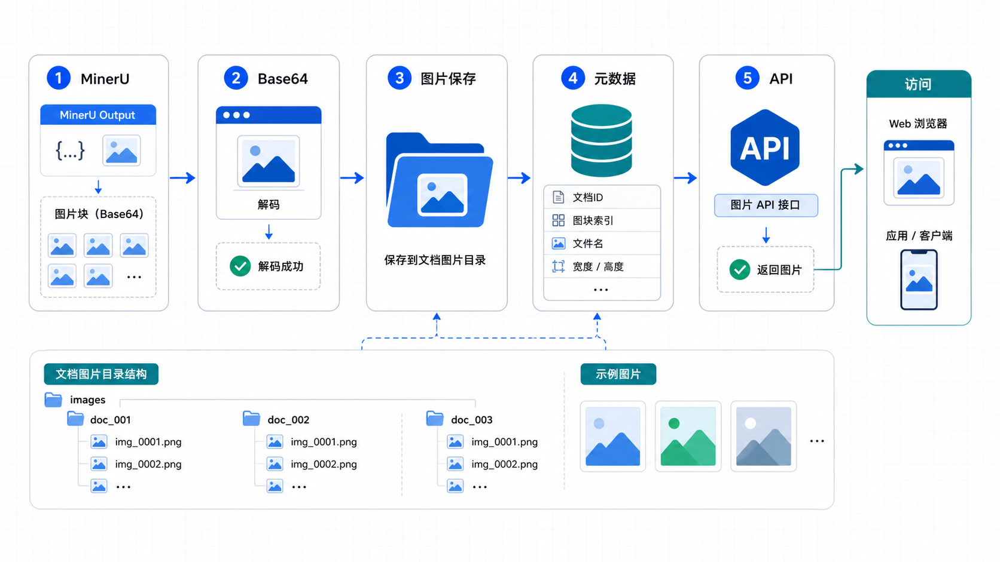

# 文档解析流程

## 1. 流程概述

文档解析是智能投标预审智能体的核心基础流程，通过 MinerU 服务将 PDF/Word 等文档解析为结构化内容。

### 1.1 解析能力

| 格式 | 支持 | 说明 |
|------|------|------|
| PDF | ✅ | 主要格式 |
| DOC/DOCX | ✅ | Word 文档 |
| XLS/XLSX | ✅ | Excel 表格 |
| PPT/PPTX | ✅ | PowerPoint |

### 1.2 解析输出

- **全文内容**: 提取文本内容
- **区块定位**: 页码、坐标、区块类型
- **表格数据**: 表格结构和内容
- **图片信息**: 图片位置和 base64
- **公式识别**: 数学公式提取

---

## 2. MinerU 服务架构

### 2.1 服务组件

```
┌─────────────────────────────────────────────────────────────┐
│                      MinerU 服务                              │
│  ┌─────────────┐ ┌─────────────┐ ┌─────────────┐            │
│  │ API Server  │ │ Parse Engine│ │ Model Store │            │
│  │ (FastAPI)   │ │ (Pipeline)  │ │ (VLM/OCR)  │            │
│  └─────────────┘ └─────────────┘ └─────────────┘            │
└─────────────────────────────────────────────────────────────┘
```

### 2.2 解析后端

| 后端 | 说明 | 适用场景 |
|------|------|---------|
| `pipeline` | 通用解析，支持多语言 | 多语言文档 |
| `vlm-auto-engine` | 本地高精度，仅中英文 | 中文招标文件 |
| `hybrid-auto-engine` | 新一代高精度，多语言 | 推荐 |

---

## 3. 文件上传流程

### 3.1 上传端点

```
POST /api/upload
Content-Type: multipart/form-data

参数:
- file: 文件
- projectId: 项目ID
- docType: 文档类型 (tender_doc/legal_doc/bid_doc)
```

### 3.2 上传流程

```
┌────────────┐
│ 用户选择   │
│ 文件上传   │
└────────────┘
      │
      ▼
┌────────────┐
│ 验证文件   │
│ 格式/大小  │
└────────────┘
      │
      ▼
┌────────────┐
│ 生成存储   │
│ 路径/UUID  │
└────────────┘
      │
      ▼
┌────────────┐
│ 保存文件   │
│ uploads/   │
└────────────┘
      │
      ▼
┌────────────┐
│ 创建文档   │
│ 数据库记录 │
└────────────┘
      │
      ▼
┌────────────┐
│ 返回文档   │
│ ID         │
└────────────┘
```

### 3.3 文件存储

```
uploads/
├── documents/
│   ├── {documentId}/
│   │   ├── original.pdf    # 原始文件
│   │   └── parsed/         # 解析结果
│   │       ├── images/     # 提取的图片
│   │       └── content.json # 解析内容
```

---

## 4. 异步解析流程

### 4.1 提交解析任务

```
POST /api/documents/[documentId]/parse

请求体:
{
  "backend": "hybrid-auto-engine",
  "timeout": 300
}

响应:
{
  "success": true,
  "taskId": "mineru-task-id",
  "status": "processing"
}
```

### 4.2 解析流程图



```
┌────────────┐     ┌────────────┐     ┌────────────┐
│ 提交任务   │────▶│ MinerU     │────▶│ 异步解析   │
│ POST /parse│     │ API Server │     │ 后台处理   │
└────────────┘     └────────────┘     └────────────┘
                                              │
                                              ▼
┌────────────┐     ┌────────────┐     ┌────────────┐
│ 状态更新   │◀────│ 结果获取   │◀────│ 解析完成   │
│ completed │     │ GET /parse │     │ 返回结果   │
└────────────┘     └────────────┘     └────────────┘
```

### 4.3 MinerU API 交互

```typescript
// src/lib/ai/mineru-client.ts

// 提交异步任务
const response = await fetch(`${MINERU_API_URL}/api/task`, {
  method: 'POST',
  body: formData,
});

const { task_id } = await response.json();

// 查询任务状态
const status = await fetch(`${MINERU_API_URL}/api/task/${task_id}/status`);

// 获取解析结果
const result = await fetch(`${MINERU_API_URL}/api/task/${task_id}/result`);
```

---

## 5. 状态轮询机制

### 5.1 前端轮询

```typescript
// 前端轮询解析状态
useEffect(() => {
  if (document.parseStatus === 'processing') {
    const interval = setInterval(async () => {
      const status = await fetch(`/api/documents/${document.id}/parse`);
      if (status.parseStatus === 'completed') {
        clearInterval(interval);
        // 刷新文档内容
      }
    }, 5000); // 每 5 秒轮询
    return () => clearInterval(interval);
  }
}, [document]);
```

### 5.2 Worker 后台检查

```typescript
// worker.ts - 定时检查 processing 文档
// src/lib/tasks/document-status-checker.ts

async function checkDocuments() {
  const processingDocs = await db.query.documents.findMany({
    where: eq(documents.parseStatus, 'processing'),
  });

  for (const doc of processingDocs) {
    const status = await mineruClient.getTaskStatus(doc.mineruTaskId);
    if (status === 'completed') {
      await updateDocumentStatus(doc.id, 'completed');
    }
  }
}
```

---

## 6. 解析结果处理

### 6.1 结果存储

```typescript
// 解析结果存入数据库
await db.insert(documentParsedResults).values({
  documentId: document.id,
  totalPages: result.total_pages,
  fullText: result.full_text,
  structuredContent: result.structured_content,
  mineruRawData: result.raw_data,
});

// 区块存入数据库
for (const block of result.blocks) {
  await db.insert(documentBlocks).values({
    parsedResultId: parsedResult.id,
    pageNumber: block.page_number,
    blockIndex: block.block_index,
    blockType: block.block_type,
    content: block.content,
    bbox: block.bbox,
  });
}
```

### 6.2 图片保存



```typescript
// src/lib/storage/image-storage.ts

async function saveMinerUImages(documentId: string, images: MinerUImage[]) {
  const imageDir = `uploads/documents/${documentId}/parsed/images`;
  await fs.mkdir(imageDir, { recursive: true });

  for (const image of images) {
    const imagePath = `${imageDir}/${image.filename}`;
    await fs.writeFile(imagePath, image.base64, 'base64');
  }
}
```

---

## 7. 错误处理

### 7.1 解析失败处理

```typescript
// 更新文档状态为失败
await db.update(documents)
  .set({
    parseStatus: 'failed',
    parseError: error.message,
  })
  .where(eq(documents.id, documentId));
```

### 7.2 重试机制

```typescript
// 重试解析
async function retryParse(documentId: string) {
  const document = await db.query.documents.findFirst({
    where: eq(documents.id, documentId),
  });

  // 重置状态
  await db.update(documents)
    .set({
      parseStatus: 'pending',
      parseError: null,
      mineruTaskId: null,
    })
    .where(eq(documents.id, documentId));

  // 重新提交
  await submitParseTask(documentId);
}
```

---

## 8. 解析状态查询

### 8.1 状态端点

```
GET /api/documents/[documentId]/parse

响应:
{
  "parseStatus": "processing",
  "taskProgress": 50,
  "mineruTaskId": "xxx",
  "taskSubmittedAt": "2024-01-01T00:00:00Z"
}
```

### 8.2 状态说明

| 状态 | 说明 |
|------|------|
| `pending` | 待解析 |
| `processing` | 正在解析 |
| `completed` | 解析完成 |
| `failed` | 解析失败 |

---

## 9. 区块数据访问

### 9.1 获取区块

```
GET /api/documents/[documentId]/blocks?pageNumber=1

响应:
{
  "blocks": [
    {
      "id": "block-uuid",
      "pageNumber": 1,
      "blockIndex": 0,
      "blockType": "text",
      "content": "文本内容...",
      "bbox": { "x0": 0, "y0": 0, "x1": 100, "y1": 50 }
    }
  ]
}
```

### 9.2 区块类型

| 类型 | 说明 |
|------|------|
| `text` | 普通文本 |
| `title` | 标题 |
| `paragraph` | 段落 |
| `table` | 表格 |
| `image` | 图片 |
| `formula` | 公式 |

---

## 10. 流程完整示例

```
1. 用户上传 PDF 文件
   POST /api/upload → 返回 documentId

2. 提交解析任务
   POST /api/documents/{id}/parse → 返回 taskId

3. 前端轮询状态
   GET /api/documents/{id}/parse → 每 5 秒检查

4. 解析完成
   parseStatus = "completed"

5. 获取区块数据
   GET /api/documents/{id}/blocks

6. 提取审查项
   POST /api/documents/{id}/extract (可选)
```
