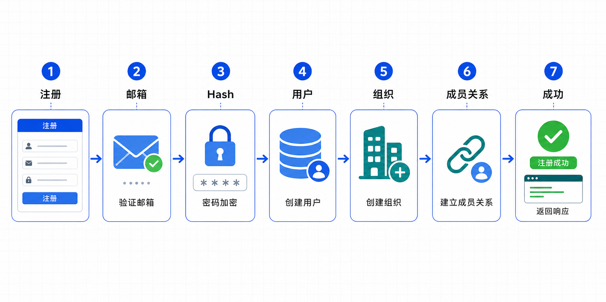
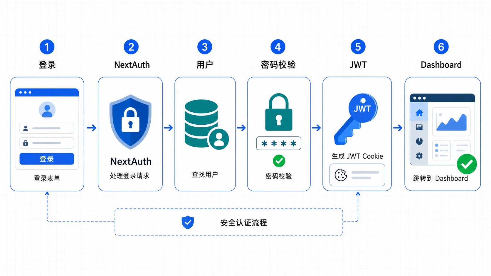

# 用户认证流程

## 1. 流程概述

智能投标预审智能体使用 NextAuth v5 实现用户认证，支持多种认证方式。

### 1.1 支持的认证方式

| 方式 | 说明 |
|------|------|
| **Credentials** | 邮箱密码登录 |
| **GitHub OAuth** | GitHub 账号登录 |
| **Google OAuth** | Google 账号登录 |

### 1.2 认证特点

- JWT Session 策略
- 支持"记住我"功能
- 密码重置邮件
- 组织级数据隔离

---

## 2. 注册流程

### 2.1 注册端点

```
POST /api/auth/register

请求体:
{
  "email": "user@example.com",
  "password": "password123",
  "name": "用户名",
  "orgName": "组织名称"
}

响应:
{
  "success": true,
  "userId": "uuid",
  "orgId": "uuid"
}
```

### 2.2 注册流程图



```
┌────────────┐
│ 用户填写   │
│ 注册表单   │
└────────────┘
      │
      ▼
┌────────────┐
│ 验证邮箱   │
│ 格式/唯一性│
└────────────┘
      │
      ▼
┌────────────┐
│ 加密密码   │
│ bcrypt hash│
└────────────┘
      │
      ▼
┌────────────┐
│ 创建用户   │
│ 数据库记录 │
└────────────┘
      │
      ▼
┌────────────┐
│ 创建组织   │
│ 自动命名   │
└────────────┘
      │
      ▼
┌────────────┐
│ 关联用户   │
│ 成员关系   │
└────────────┘
      │
      ▼
┌────────────┐
│ 返回成功   │
│ 重定向登录 │
└────────────┘
```

### 2.3 注册代码

```typescript
// src/app/api/auth/register/route.ts

export async function POST(request: NextRequest) {
  const { email, password, name, orgName } = await request.json();

  // 检查邮箱唯一性
  const existing = await db.query.users.findFirst({
    where: eq(users.email, email),
  });
  if (existing) {
    return NextResponse.json({ error: '邮箱已注册' }, { status: 400 });
  }

  // 加密密码
  const passwordHash = await bcrypt.hash(password, 10);

  // 创建用户
  const [user] = await db.insert(users).values({
    email,
    passwordHash,
    name,
    role: 'supplier_admin',
  }).returning();

  // 创建组织
  const [org] = await db.insert(organizations).values({
    name: orgName || `${name}的组织`,
    slug: generateSlug(),
    orgType: 'supplier',
  }).returning();

  // 关联成员
  await db.insert(organizationMembers).values({
    orgId: org.id,
    userId: user.id,
    role: 'admin',
  });

  return NextResponse.json({ success: true, userId: user.id });
}
```

---

## 3. 登录流程

### 3.1 Credentials 登录

```
POST /api/auth/[...nextauth]
provider: credentials

请求体:
{
  "email": "user@example.com",
  "password": "password123",
  "rememberMe": true
}
```

### 3.2 登录流程图



```
┌────────────┐
│ 用户填写   │
│ 登录表单   │
└────────────┘
      │
      ▼
┌────────────┐
│ NextAuth   │
│ 处理请求   │
└────────────┘
      │
      ▼
┌────────────┐
│ 查询用户   │
│ 数据库     │
└────────────┘
      │
      ▼
┌────────────┐
│ 验证密码   │
│ bcrypt compare│
└────────────┘
      │
      ▼
┌────────────┐
│ 查询组织   │
│ 成员关系   │
└────────────┘
      │
      ▼
┌────────────┐
│ 生成 JWT   │
│ 设置 Cookie│
└────────────┘
      │
      ▼
┌────────────┐
│ 重定向     │
│ Dashboard  │
└────────────┘
```

### 3.3 认证配置

```typescript
// src/lib/auth/config.ts

Credentials({
  name: 'credentials',
  credentials: {
    email: { label: 'Email', type: 'email' },
    password: { label: 'Password', type: 'password' },
    rememberMe: { label: 'Remember Me', type: 'text' },
  },
  async authorize(credentials) {
    const user = await db.query.users.findFirst({
      where: eq(users.email, credentials.email),
    });

    if (!user || !user.passwordHash) return null;

    const isValid = await bcrypt.compare(
      credentials.password,
      user.passwordHash
    );

    if (!isValid) return null;

    const membership = await db.query.organizationMembers.findFirst({
      where: eq(organizationMembers.userId, user.id),
    });

    return {
      id: user.id,
      email: user.email,
      name: user.name,
      role: user.role,
      orgId: membership?.orgId,
      rememberMe: credentials.rememberMe === 'true',
    };
  },
}),
```

---

## 4. OAuth 登录流程

### 4.1 OAuth 流程图


```
┌────────────┐
│ 点击 OAuth │
│ 登录按钮   │
└────────────┘
      │
      ▼
┌────────────┐
│ 重定向到   │
│ OAuth 服务 │
└────────────┘
      │
      ▼
┌────────────┐
│ 用户授权   │
│ 应用访问   │
└────────────┘
      │
      ▼
┌────────────┐
│ OAuth 返回 │
│ Access Token│
└────────────┘
      │
      ▼
┌────────────┐
│ NextAuth   │
│ 处理回调   │
└────────────┘
      │
      ▼
┌────────────┐
│ 创建/更新  │
│ 用户账户   │
└────────────┘
      │
      ▼
┌────────────┐
│ 生成 JWT   │
│ 设置 Cookie│
└────────────┘
      │
      ▼
┌────────────┐
│ 重定向     │
│ Dashboard  │
└────────────┘
```

### 4.2 OAuth Provider 配置

```typescript
// src/lib/auth/config.ts

GitHub({
  clientId: process.env.AUTH_GITHUB_ID,
  clientSecret: process.env.AUTH_GITHUB_SECRET,
}),

Google({
  clientId: process.env.AUTH_GOOGLE_ID,
  clientSecret: process.env.AUTH_GOOGLE_SECRET,
}),
```

### 4.3 OAuth 回调 URL

```
GitHub: http://localhost:3000/api/auth/callback/github
Google: http://localhost:3000/api/auth/callback/google
```

---

## 5. Session 管理

### 5.1 JWT Session 配置

```typescript
session: {
  strategy: 'jwt',
  maxAge: 30 * 24 * 60 * 60, // 30 天
},
```

### 5.2 JWT 回调

```typescript
callbacks: {
  async jwt({ token, user }) {
    if (user) {
      token.id = user.id;
      token.role = user.role;
      token.orgId = user.orgId;

      // 记住我：30天，不记住：8小时
      const maxAge = user.rememberMe
        ? 30 * 24 * 60 * 60
        : 8 * 60 * 60;
      token.exp = Math.floor(Date.now() / 1000) + maxAge;
    }
    return token;
  },
},
```

### 5.3 Session 回调

```typescript
async session({ session, token }) {
  if (session.user) {
    session.user.id = token.id;
    session.user.role = token.role;
    session.user.orgId = token.orgId;
  }
  return session;
},
```

---

## 6. 密码重置流程

### 6.1 请求重置

```
POST /api/auth/forgot-password

请求体:
{
  "email": "user@example.com"
}

响应:
{
  "success": true,
  "message": "重置邮件已发送"
}
```

### 6.2 执行重置

```
POST /api/auth/reset-password

请求体:
{
  "token": "reset-token",
  "password": "new-password"
}

响应:
{
  "success": true
}
```

### 6.3 密码重置流程图


```
┌────────────┐
│ 用户请求   │
│ 密码重置   │
└────────────┘
      │
      ▼
┌────────────┐
│ 查询用户   │
│ 验证邮箱   │
└────────────┘
      │
      ▼
┌────────────┐
│ 生成令牌   │
│ 存入数据库 │
└────────────┘
      │
      ▼
┌────────────┐
│ 发送邮件   │
│ Resend API │
└────────────┘
      │
      ▼
┌────────────┐
│ 用户点击   │
│ 重置链接   │
└────────────┘
      │
      ▼
┌────────────┐
│ 验证令牌   │
│ 检查过期   │
└────────────┘
      │
      ▼
┌────────────┐
│ 更新密码   │
│ 标记令牌使用│
└────────────┘
```

---

## 7. 权限验证

### 7.1 API 权限验证

```typescript
// API 路由中验证
const session = await auth();
if (!session) {
  return NextResponse.json({ error: 'Unauthorized' }, { status: 401 });
}

// 验证组织权限
const targetOrgId = params.orgId;
if (session.user.orgId !== targetOrgId) {
  return NextResponse.json({ error: 'Forbidden' }, { status: 403 });
}
```

### 7.2 前端权限验证

```typescript
// 页面组件中
import { useSession } from 'next-auth/react';

const { data: session, status } = useSession();

if (status === 'loading') return <Spinner />;
if (status === 'unauthenticated') return redirect('/login');

// 根据角色显示不同内容
if (session.user.role === 'system_admin') {
  // 显示管理员功能
}
```

---

## 8. 认证状态持久化

### 8.1 前端 Session Provider

```typescript
// src/app/layout.tsx
<AuthProvider>
  {children}
</AuthProvider>

// src/components/providers/auth-provider.tsx
export function AuthProvider({ children }) {
  return (
    <SessionProvider refetchInterval={5 * 60}>
      {children}
    </SessionProvider>
  );
}
```

### 8.2 Session 刷新

- 每 5 分钟自动刷新
- JWT 过期前自动续期

---

## 9. 登出流程

### 9.1 登出操作

```typescript
import { signOut } from 'next-auth/react';

// 前端调用
await signOut({ callbackUrl: '/login' });
```

### 9.2 登出流程

```
┌────────────┐
│ 用户点击   │
│ 登出按钮   │
└────────────┘
      │
      ▼
┌────────────┐
│ 清除 JWT   │
│ Cookie     │
└────────────┘
      │
      ▼
┌────────────┐
│ 重定向     │
│ 登录页     │
└────────────┘
```

---

## 10. 认证页面结构

```
src/app/(auth)/
├── layout.tsx              # 认证布局
├── login/page.tsx          # 登录页
├── register/page.tsx       # 注册页
├── forgot-password/page.tsx # 密码重置请求
└── reset-password/page.tsx  # 密码重置执行
```

### 10.1 登录页功能

- 邮箱密码登录
- GitHub/Google OAuth 登录
- 记住我选项
- 注册链接
- 密码重置链接

### 10.2 注册页功能

- 邮箱验证
- 密码强度提示
- 组织名称设置
- OAuth 快捷注册
